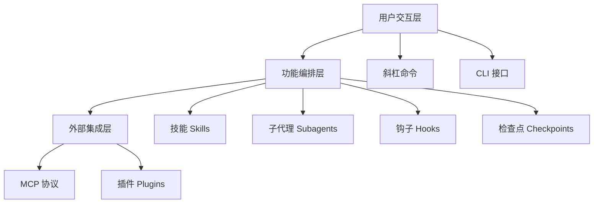

今天在 GitHub Trending 上看到一个有意思的项目：**Claude How To**，它提供了一条从零基础到精通 Claude Code 的完整学习路径，只需一个周末就能掌握从斜杠命令到代理编排、钩子、技能和 MCP 服务器的所有功能。

## 一、项目概述

**Claude How To** 是一个开源的 Claude Code 完整教程，目标是帮助开发者在 11-13 小时内从只会输入 `claude` 命令，成长到能够编排代理、钩子、技能和 MCP 服务器的程度。

### 核心问题

项目直接回应了使用 Claude Code 的三大痛点：

1. **官方文档只描述功能，不教组合使用** —— 你知道斜杠命令存在，但不知道如何将其与钩子、记忆、子代理串联成高效工作流
2. **缺乏清晰的学习路径** —— 应该先学 MCP 还是钩子？先学技能还是子代理？
3. **示例过于基础** —— "Hello World" 级别的示例无法帮助你构建生产级的代码审查流水线

### 解决方案

这个项目提供了：

- **10 个教程模块**：覆盖 Claude Code 所有功能
- **可复制的配置模板**：斜杠命令、CLAUDE.md 模板、钩子脚本、MCP 配置、子代理定义、完整插件包
- **Mermaid 可视化图**：展示每个功能的内部工作原理
- **引导式学习路径**：从新手到高手只需 11-13 小时
- **内置自测系统**：运行 `/self-assessment` 或 `/lesson-quiz hooks` 识别知识盲区

## 二、技术原理

### 架构设计

Claude Code 的功能体系分为三层：



**层级职责：**

- **用户交互层**：斜杠命令（`/optimize`、`/pr`）和 CLI 接口提供用户入口
- **功能编排层**：技能、子代理、钩子和检查点构成核心工作流引擎
- **外部集成层**：MCP 协议和插件连接外部工具和服务

### 核心功能模块

| 功能 | 调用方式 | 持久性 | 适用场景 |
|------|---------|--------|---------|
| **斜杠命令** | 手动 `/cmd` | 仅会话内 | 快速快捷键 |
| **记忆** | 自动加载 | 跨会话 | 长期学习 |
| **技能** | 自动触发 | 文件系统 | 自动化工作流 |
| **子代理** | 自动委托 | 隔离上下文 | 任务分发 |
| **MCP 协议** | 自动查询 | 实时 | 实时数据访问 |
| **钩子** | 事件触发 | 配置化 | 自动化与验证 |
| **插件** | 一条命令 | 全功能 | 完整解决方案 |
| **检查点** | 手动/自动 | 基于会话 | 安全实验 |
| **后台任务** | 手动 | 任务期间 | 长时间操作 |

### 钩子系统详解

钩子是事件驱动的 shell 命令，Claude Code 支持 5 类 29 种事件：

```python
# 钩子配置示例（来自项目源码）
{
  "hooks": {
    "PreToolUse": [{
      "matcher": "Write",
      "hooks": ["~/.claude/hooks/format-code.sh"]
    }],
    "PostToolUse": [{
      "matcher": "Write", 
      "hooks": ["~/.claude/hooks/security-scan.sh"]
    }]
  }
}
```

**钩子类型分类：**

1. **工具钩子**：`PreToolUse`、`PostToolUse`、`PostToolUseFailure`、`PermissionRequest`
2. **会话钩子**：`SessionStart`、`SessionEnd`、`Stop`、`StopFailure`、`SubagentStart`、`SubagentStop`
3. **任务钩子**：`UserPromptSubmit`、`TaskCompleted`、`TaskCreated`、`TeammateIdle`
4. **生命周期钩子**：`ConfigChange`、`CwdChanged`、`FileChanged`、`PreCompact`、`PostCompact`...

### MCP 协议集成

MCP（Model Context Protocol）是 Claude Code 连接外部工具的标准协议：

```bash
# 添加 GitHub MCP 服务器
claude mcp add github -- npx -y @modelcontextprotocol/server-github

# 添加数据库 MCP 服务器
export DATABASE_URL="postgresql://..."
claude mcp add database -- npx -y @modelcontextprotocol/server-postgres
```

配置完成后，Claude 可以自动调用这些工具获取实时数据。

## 三、安装与快速开始

### 环境要求

- Claude Code v2.1.116+（原生二进制版本）
- 支持 macOS / Linux / Windows
- 可选：Python 3.10+（用于 EPUB 生成）

### 15 分钟快速上手

```bash
# 1. 克隆教程仓库
git clone https://github.com/luongnv89/claude-howto.git
cd claude-howto

# 2. 复制你的第一个斜杠命令
mkdir -p /path/to/your-project/.claude/commands
cp 01-slash-commands/optimize.md /path/to/your-project/.claude/commands/

# 3. 在 Claude Code 中尝试
# 输入: /optimize

# 4. 设置项目记忆
cp 02-memory/project-CLAUDE.md /path/to/your-project/CLAUDE.md

# 5. 安装一个技能
cp -r 03-skills/code-review-specialist ~/.claude/skills/
```

### 1 小时完整配置

```bash
# 斜杠命令（15分钟）
cp 01-slash-commands/*.md .claude/commands/

# 项目记忆（15分钟）
cp 02-memory/project-CLAUDE.md ./CLAUDE.md

# 安装技能（15分钟）
cp -r 03-skills/code-review-specialist ~/.claude/skills/

# 周末目标：添加钩子、子代理、MCP 和插件
# 按学习路径逐步完成
```

## 四、使用方法与实战

### 场景一：自动化代码审查流水线

结合斜杠命令 + 子代理 + 记忆 + MCP：

```markdown
用户: /review-pr

Claude 执行流程:
1. 加载项目记忆（编码规范）
2. 通过 GitHub MCP 获取 PR 信息
3. 委托给 code-reviewer 子代理
4. 委托给 test-engineer 子代理
5. 综合分析并输出审查报告
```

**配置示例：**

```bash
# 安装子代理
cp 04-subagents/*.md .claude/agents/

# 配置 GitHub MCP
export GITHUB_TOKEN="your_token"
claude mcp add github -- npx -y @modelcontextprotocol/server-github
```

### 场景二：团队知识库建设

使用记忆 + 斜杠命令 + 插件：

```bash
# 项目级记忆（团队共享规范）
cp 02-memory/project-CLAUDE.md ./CLAUDE.md

# 目录级记忆（API 目录规范）
cp 02-memory/directory-api-CLAUDE.md ./src/api/CLAUDE.md

# 个人记忆（个人偏好）
cp 02-memory/personal-CLAUDE.md ~/.claude/CLAUDE.md
```

**记忆优先级**：目录级 > 项目级 > 个人级

### 场景三：CI/CD 集成

使用 Headless 模式和钩子：

```bash
# 在 CI 流水线中运行
claude -p "review this code" --output-format json

# 配置预提交钩子
mkdir -p ~/.claude/hooks
cp 06-hooks/pre-commit.sh ~/.claude/hooks/
chmod +x ~/.claude/hooks/pre-commit.sh
```

**钩子配置示例：**

```json
{
  "hooks": {
    "PreToolUse": [{
      "matcher": "Write",
      "hooks": ["~/.claude/hooks/format-code.sh"]
    }]
  }
}
```

### 场景四：安全审计工作流

结合子代理 + 技能 + 钩子（只读模式）：

```bash
# 安装安全审查技能
cp -r 03-skills/secure-reviewer ~/.claude/skills/

# 配置安全扫描钩子
cp 06-hooks/security-scan.sh ~/.claude/hooks/
```

## 五、常见问题与解决方案

### Q1: 安装后功能未加载？

**原因**：文件位置或命名错误，YAML frontmatter 语法问题。

**解决方案**：

```bash
# 检查斜杠命令位置
ls -la .claude/commands/

# 检查技能目录结构
tree ~/.claude/skills/code-review-specialist/

# 验证 YAML 语法
cat .claude/commands/optimize.md | head -20
```

### Q2: MCP 连接失败？

**原因**：环境变量未设置，MCP 服务器未安装，网络问题。

**解决方案**：

```bash
# 验证环境变量
echo $GITHUB_TOKEN

# 测试 MCP 服务器
npx -y @modelcontextprotocol/server-github --help

# 检查网络连接
curl -I https://api.github.com
```

### Q3: 子代理未触发委托？

**原因**：工具权限不足，代理描述不清晰，任务复杂度不够。

**解决方案**：

```bash
# 检查代理配置
cat .claude/agents/code-reviewer.md

# 测试代理独立运行
claude -a code-reviewer "review this code"

# 调整任务复杂度
# 简单任务不会触发委托，需要明确的复杂指令
```

### Q4: 检查点回退后代码丢失？

**原因**：检查点默认只保存对话状态，未选择恢复代码。

**解决方案**：

使用 `/rewind` 时选择：
- **选项 1**：恢复代码和对话（推荐）
- **选项 3**：仅恢复代码

### Q5: 如何离线阅读教程？

**解决方案**：

```bash
# 生成 EPUB 电子书（包含渲染后的 Mermaid 图表）
uv run scripts/build_epub.py

# 输出: claude-howto-guide.epub
```

## 六、总结

**Claude How To** 的价值在于它不是功能参考手册，而是一套**结构化、可视化、可复制**的学习路径。它填补了官方文档的空白——教你如何组合功能，而不是孤立地介绍每个功能。

**核心优势：**

1. **渐进式学习**：从 15 分钟体验到 13 小时完整路径，适应不同时间预算
2. **生产级模板**：每个配置都是可直接用于真实项目的成熟方案
3. **可视化理解**：Mermaid 图表帮助你理解功能内部原理
4. **自测反馈**：内置 quiz 系统帮助识别知识盲区
5. **持续更新**：跟随 Claude Code 每个版本更新（当前 v2.1.160）

**适用人群：**

- 已安装 Claude Code 但只用到 10% 功能的开发者
- 希望构建自动化工作流的技术团队
- 需要将 AI 能力集成到 CI/CD 流水线的 DevOps 工程师
- 想要系统学习 Claude Code 最佳实践的任何人

**项目信息：**

- GitHub: https://github.com/luongnv89/claude-howto
- License: MIT
- Stars: 1,800+（GitHub Trending 榜首）
- 兼容模型: Claude Sonnet 4.6 / Opus 4.8 / Haiku 4.5

如果你已经在使用 Claude Code，这个项目会帮你释放剩余的 90% 能力。如果你还没开始，它会是最短的入门路径。

**下一步行动**：克隆仓库，复制第一个斜杠命令，用 `/optimize` 体验 15 分钟的价值。
