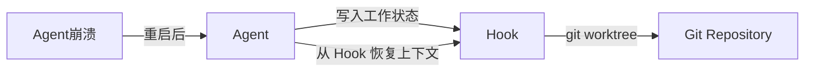

今天在 GitHub Trending 上看到一个有意思的项目：**Gas Town**，它是一个多智能体（Multi-Agent）编排系统，可以让 Claude Code、GitHub Copilot、Codex 等多种 AI 编程助手在同一项目中协同工作，核心解决的是 AI Agent 重启后上下文丢失和多 Agent 协调混乱的问题。

## 一、项目概述

Gas Town 由资深开发者 Steve Yegge（Google 前工程师、Stevey's Blog 作者）主导开发，是一个完全用 Go 语言编写的命令行工具，支持 Docker 部署。它将 AI 协作场景中常见的"上下文丢失""手动协调""工作状态丢失"等痛点，通过 Git 工作树（git worktree）和结构化数据（Beads ledger）的方式全部持久化下来，让 AI Agent 可以像真正的团队成员一样持续工作。

### 核心特性

- **Git 驱动的持久化**：每个 Agent 的工作状态存储在 Git worktree 中，重启后自动恢复，永久不怕崩溃
- **多运行时支持**：Claude Code、GitHub Copilot、Codex、Cursor、Gemini 等多种 AI 编码助手混合编排
- **Mayor 调度中心**：通过自然语言命令协调多个 Agent，支持自主任务分发和进度追踪
- **Convoy 任务队列**：以 Convoy（车队）为单位管理 Beads（工作单元），支持 P0-P2 优先级和自动升级
- **三段式监控系统**：Witness（单项目健康监控）→ Deacon（跨项目巡逻）→ Dogs（自动修复任务）
- **Bors 风格合并队列**：Refinery 对 Agent 的 PR 进行批量验证和合并，防止破坏主分支
- **联邦工作网络**：Wasteland 允许跨 Gas Town 协作，DoltHub 驱动的去中心化任务分发

## 二、技术原理

### 2.1 架构设计

Gas Town 的整体架构围绕一个中心（Mayor）和多个工作空间（Rig）展开：

```
                    Mayor（AI 协调者）
                         |
              ┌──────────┴──────────┐
              │    Town Workspace  │
              │     (~/gt/)        │
              └──────────┬──────────┘
           ┌─────────────┼─────────────┐
           │             │             │
        Rig A         Rig B         Rig C
     (项目 A)       (项目 B)       (项目 C)
           │             │             │
      ┌────┴────┐   ┌────┴────┐   ┌────┴────┐
    Crew   Polecats  Crew  Polecats  Crew  Polecats
   (你的    (Worker   (你的   (Worker   (你的   (Worker
   工作区)   Agent)   工作区)  Agent)   工作区)  Agent)
           │             │
      ┌────┴────┐   ┌────┴────┐
        Hooks      Hooks
    (Git worktree) (Git worktree)
```

- **Mayor**：主协调者，在 Mayor session 中运行，通过自然语言接收指令，创建 Convoy 并分配 Beads 给 Agent
- **Rig**：项目容器，每个 Rig 关联一个独立的 Git 仓库
- **Polecat**：工作 Agent，有持久化身份但临时会话，每个 Polecat 对应一个 Git worktree
- **Hook**：Git worktree 作为持久化存储，Agent 重启后自动恢复
- **Bead**：工作追踪单元，本质是 GitHub Issue，数据存储在 Beads ledger（类 issue tracker）中

### 2.2 持久化机制：Git Worktree Hooks

传统 AI Agent 的最大问题是"记忆在内存里，重启就丢"。Gas Town 的解决方案非常巧妙——用 Git worktree 作为持久化层：



每个 Polecat 在启动时会创建一个 Git worktree 作为自己的"工作目录"，所有文件修改都在 worktree 中进行。当 Agent 重启时，只需要重新指向同一个 worktree，上下文就全部恢复了。worktree 的内容通过 git commit 提交到仓库，完全享受版本控制的全部好处。

### 2.3 Beads 工作追踪系统

Beads 是 Gas Town 中的工作单元，格式为前缀 + 5位字母数字 ID（如 `gt-abc12`），本质是结构化的 GitHub Issues：

```bash
# 创建工作单元
bd create "实现用户认证模块" --rig myproject --severity HIGH

# 将 Bead 分配给 Agent
gt sling gt-abc12 myproject

# 追踪进度
gt convoy list
gt convoy show cv-xyz789
```

Convoy（车队）是一组 Beads 的集合，支持 DAG 依赖关系和 `mountain` 标签下的自动停滞检测：

```toml
# Beads Formula（类似 CI/CD 流水线定义）
[[steps]]
id = "run-tests"
title = "运行测试"
description = "执行 make test"
needs = ["build"]

[[steps]]
id = "build"
title = "构建"
description = "执行 make build"
needs = ["bump-version"]
```

### 2.4 Molecules 配方系统

Molecules 是可复用的工作流模板，通过 TOML 定义步骤依赖图：

```bash
# 列出内置配方
bd formula list

# 执行配方（类似 Makefile 但面向 AI 工作流）
bd cook release --var version=1.2.0

# 创建可追踪的配方实例
bd mol pour release --var version=1.2.0
bd mol list  # 查看运行中的实例
```

内置配方包括标准发布流程、代码审查流水线等。配方可以是轻量级的 "root-only wisps"（步骤在运行时才实例化），也可以是带检查点恢复的 "poured wisps"。

### 2.5 监控与健康体系

Gas Town 实现了完整的三段式 Agent 健康监控：

| 层级 | 组件 | 职责 |
|------|------|------|
| Per-Rig | **Witness** | 单项目生命周期管理，检测 stuck Agent，触发恢复 |
| Cross-Rig | **Deacon** | 跨项目巡逻调度，分配 Dogs 维护任务 |
| Global | **Dogs** | 具体维护工作者，如 `Boot`（分类整理） |

Escalation 机制：当 Agent 遇到阻塞时，通过 `gt escalate -s HIGH "描述"` 升级，经由 Deacon → Mayor → Overseer 路由：

```
Severity = CRITICAL (P0) → 直接上报 Overseer
Severity = HIGH (P1)     → Mayor 处理
Severity = MEDIUM (P2)   → Deacon 处理
```

### 2.6 Refinery 合并队列

传统多 Agent 开发的问题是每个 Agent 都往主分支 push，导致 CI 混乱。Refinery 实现了一个 Bors 风格的合并队列：

1. Polecat 完成工作 → `gt done` → 分支 push，MR Bead 创建
2. Refinery 批量收集待处理 MRs
3. 在合并栈上运行验证门控
4. 全部通过 → 批量合并到 main
5. 失败 → 二分查找隔离失败 MR，合并好的部分

## 三、安装与快速开始

### 环境要求

- **Go 1.25+**
- **Git 2.25+**（支持 worktree）
- **Dolt 2.0.7+**（Beads ledger 存储）
- **beads (bd) 0.55.4+**
- **tmux 3.0+**（推荐）
- **Claude Code CLI**（默认运行时）

### 安装步骤

```bash
# macOS（推荐方式）
brew install gastown

# npm
npm install -g @gastown/gt

# Go 从源码编译（Linux only）
go install github.com/steveyegge/gastown/cmd/gt@latest

# 如果是 macOS，用 make 编译
git clone https://github.com/steveyegge/gastown.git && cd gastown
make build && mv gt $HOME/go/bin/

# 创建 Gas Town 工作空间
gt install ~/gt --git
cd ~/gt

# 添加第一个项目
gt rig add myproject https://github.com/you/repo.git

# 启动 Mayor（主协调界面）
gt mayor attach
```

### Docker 部署

```bash
export GIT_USER="<your name>"
export GIT_EMAIL="<your email>"
export FOLDER="/Users/you/code"
export DASHBOARD_PORT=8080

docker compose build
docker compose up -d
docker compose exec gastown zsh

gt up
gh auth login
gt mayor attach  # 开始使用
```

## 四、使用方法与实战

### 4.1 Mayor 工作流（推荐）

最推荐的团队协作模式，Mayor 充当 AI 协调者：

```bash
# 1. 启动 Mayor
gt mayor attach

# 2. 在 Mayor 中创建车队并分配任务
gt convoy create "用户认证系统" gt-abc12 gt-def34 --notify --human

# 3. 将工作分配给 Worker Agent
gt sling gt-abc12 myproject

# 4. 追踪进度
gt convoy list

# 5. 实时监控
gt feed
```

### 4.2 基础工作流示例

```bash
# 查看所有 Agent
gt agents

# 分配工作
gt sling gt-abc12 myproject --agent cursor  # 指定使用 Cursor

# 监控所有 Agent 活动
gt feed

# 查看问题（哪些 Agent 卡住了）
gt feed --problems

# 给卡住的 Agent 发送提醒
gt nudge <agent-id>

# 完成工作
gt done gt-abc12  # 自动创建 MR 并推送到 Refinery
```

### 4.3 Beads Formula 工作流

适用于标准化的重复流程：

```bash
# 创建一个标准化发布流程
bd cook release --var version=1.2.0

# 创建可追踪实例
bd mol pour release --var version=1.2.0

# 列出所有活动中的配方实例
bd mol list
```

### 4.4 多运行时配置

在 `settings/config.json` 中配置每个 Rig 的运行时：

```json
{
  "runtime": {
    "provider": "codex",
    "command": "codex",
    "args": [],
    "prompt_mode": "none"
  }
}
```

内置运行时预设：`claude`、`gemini`、`codex`、`cursor`、`auggie`、`copilot` 等。

### 4.5 Seance — 跨会话记忆恢复

这是 Gas Town 最神奇的功能之一：查询前任 Agent 会话的决策：

```bash
# 列出可发现的前任会话
gt seance

# 与前任会话进行完整上下文对话
gt seance --talk <session-id>

# 一句话问前任
gt seance --talk <session-id> -p "上次你在这个模块做了什么决策？"
```

通过 `.events.jsonl` 日志发现历史会话，Agent 可以查询前任的思考过程和决策理由。

## 五、常见问题与解决方案

### 安装时 Go 版本过旧

macOS 系统的 `apt golang-go` 包版本过低。直接从 golang.org/dl 安装指定版本：

```bash
go install golang.org/dl/go1.25.8@latest
go1.25.8 download
go1.25.8 version  # 确认为 1.25+
```

### Agent 失去连接

检查 Hooks 是否正确初始化：

```bash
gt hooks list
gt hooks repair
```

### Convoy 卡住不动

强制刷新：

```bash
gt convoy refresh <convoy-id>
```

### Mayor 无响应

重启 Mayor session：

```bash
gt mayor detach
gt mayor attach
```

### macOS 上 go install 产生未签名二进制

macOS 会杀掉未签名二进制。使用 Homebrew 安装：

```bash
brew install gastown
```

或 clone 后用 make 编译：

```bash
brew install dolt
git clone https://github.com/steveyegge/gastown.git && cd gastown
make build && mv gt $HOME/go/bin/
```

### Dolt 数据库初始化失败

确保 Dolt 版本为 2.0.7+：

```bash
dolt version
brew upgrade dolt  # 或 dolt_install.sh
```

## 六、总结

Gas Town 解决了一个在 AI 编程时代越来越重要的问题：当多个 AI Agent 协同工作时，如何保证工作的连续性、可追踪性和可靠性。它通过三个核心设计做到了这一点：

1. **Git 作为持久化层**：用 worktree 和 commit 代替内存，让 Agent 重启不丢上下文
2. **结构化工作追踪**：Beads + Convoy + Molecules 构成了一套完整的工作流体系
3. **多层级监控**：Witness/Deacon/Dogs 三段式体系让多 Agent 协作也有章可循

如果你正在管理一个需要多个 AI 编码助手协作的项目，或者想让 Claude Code 拥有真正的"团队协作能力"，Gas Town 值得关注。它的 Mayor 调度模式和 Git 驱动的持久化机制是当前多智能体协作领域一个非常务实的工程方案。
