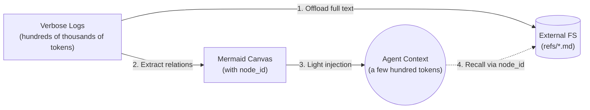

今天在 GitHub Trending 上看到一个值得关注的开源项目：**TencentDB Agent Memory**，它通过符号化短期记忆和分层长期记忆架构，解决了 AI Agent 记忆管理的核心难题——在节省 Token 的同时保留完整的可追溯性。

## 一、项目概述

TencentDB Agent Memory 是腾讯团队开源的四层记忆系统插件，专为 OpenClaw 和 Hermes Agent 设计。核心理念是"**拒绝平面存储，拥抱分层与符号化**"，通过分层架构让 Agent 不仅"记住更多"，更能"推理更好"。

### 核心问题

在长任务和长会话中，AI Agent 面临两大记忆困境：

1. **短期记忆爆炸**：工具调用日志、搜索结果、错误堆栈等中间产物占用大量 Token
2. **长期记忆扁平化**：传统向量数据库将对话碎片化存储，缺乏宏观结构指引

### 解决方案

项目采用双支柱架构：

- **符号化短期记忆**：将冗长的工具日志卸载到外部文件，在上下文中仅保留轻量级 Mermaid 任务图，通过 `node_id` 追溯原始文本
- **分层长期记忆**：构建语义金字塔 L0 Conversation → L1 Atom → L2 Scenario → L3 Persona，每层各司其职

### 性能数据

在 OpenClaw 基准测试中表现亮眼：

| 记忆类型 | 基准测试 | 成功率提升 | Token 节省 |
|---------|---------|-----------|-----------|
| 短期记忆 | WideSearch | +51.52% | -61.38% |
| 短期记忆 | SWE-bench | +9.93% | -33.09% |
| 短期记忆 | AA-LCR | +7.95% | -30.98% |
| 长期记忆 | PersonaMem | 48% → 76% | — |

## 二、技术原理

### 1. 分层记忆架构

传统记忆系统将数据碎片化后直接丢入平面向量库，召回退化为盲目搜索。TencentDB Agent Memory 采用**渐进式披露**原则：

```
L3 Persona（用户画像）
    ↓ 下钻
L2 Scenario（场景块）
    ↓ 下钻
L1 Atom（原子事实）
    ↓ 下钻
L0 Conversation（原始对话）
```

**上层承载判断与方向，下层承载证据与精度**。例如：

- 日常偏好、长期目标 → 先看 L3 Persona，需要细节时再下钻到 L1/L0
- 特定事实、日期、项目细节 → 直接查 L1 Atom，再扩大时间范围
- 恢复历史任务 → 从元数据入口 → 打开 Mermaid 画布 → 定位 `node_id` → 追溯 `result_ref`

### 2. 符号化记忆（Mermaid Canvas）

这是短期记忆压缩的核心创新。在长任务中，最大的 Token 消耗来自冗长的中间日志（搜索结果、代码、错误堆栈）。解决方案：



**三步压缩流程**：

1. **历史卸载**：完整工具日志写入外部文件 `refs/*.md`
2. **符号提取**：提取任务状态转移关系，生成 Mermaid 图（含 `node_id`）
3. **轻量注入**：上下文仅注入 Mermaid 图，需要细节时通过 `node_id` 追溯

### 3. 异构存储策略

采用双层存储：

- **底层**（事实、日志、轨迹）：持久化到数据库，支持全文检索
- **顶层**（画像、场景、画布）：存储为人类可读的 Markdown 文件，信息密度高、白盒可检

**下层保留证据，上层保留结构**，保证压缩过程完全可逆。

### 4. 核心源码分析

#### 插件注册入口（index.ts）

```typescript
export default function register(api: OpenClawPluginApi) {
  // 解析配置
  const cfg = parseConfig(api.pluginConfig);
  
  // 创建主机适配器 + 核心实例
  const hostAdapter = new OpenClawHostAdapter({
    api,
    pluginDataDir,
    openclawConfig: api.config,
  });
  
  const core = new TdaiCore({
    hostAdapter,
    config: cfg,
    sessionFilter,
  });
  
  // 注册工具
  api.registerTool({
    name: "tdai_memory_search",
    description: "搜索用户的长期记忆...",
    async execute(_toolCallId, params) {
      return await core.searchMemories({
        query: params.query,
        limit: params.limit,
        type: params.type,
        scene: params.scene
      });
    }
  });
}
```

#### 自动召回钩子（before_prompt_build）

```typescript
api.on("before_prompt_build", async (event, ctx) => {
  const userText = event.prompt;
  const result = await core.handleBeforeRecall(userText, sessionKey);
  
  // 返回注入上下文
  return {
    appendSystemContext: result.appendSystemContext,
    prependContext: result.prependContext
  };
});
```

#### 自动捕获钩子（agent_end）

```typescript
api.on("agent_end", async (event, ctx) => {
  const messages = event.messages;
  
  // 记录 L0 对话 + 调度 L1/L2/L3 提取
  const result = await core.handleTurnCommitted({
    userText: originalUserText,
    messages,
    sessionKey,
    sessionId
  });
  
  // 上报指标
  report("agent_turn", {
    recalledL1Count: cachedRecall?.l1Memories?.length ?? 0,
    l0CapturedCount: result.l0RecordedCount
  });
});
```

## 三、安装与快速开始

### 方式一：OpenClaw 插件（推荐）

```bash
# 安装插件
openclaw plugins install @tencentdb-agent-memory/memory-tencentdb

# 重启 Gateway
openclaw gateway restart
```

### 方式二：Hermes Agent 集成

#### Docker 一键启动（推荐新用户）

```bash
# 构建镜像
cd docker/opensource
docker build -f Dockerfile.hermes -t hermes-memory .

# 启动容器
docker run -d \
  --name hermes-memory \
  --restart unless-stopped \
  -p 8420:8420 \
  -e MODEL_API_KEY="your-api-key" \
  -e MODEL_BASE_URL="https://api.lkeap.cloud.tencent.com/v1" \
  -e MODEL_NAME="deepseek-v3.2" \
  -e MODEL_PROVIDER="custom" \
  -v hermes_data:/opt/data \
  hermes-memory

# 验证
curl http://localhost:8420/health
```

#### 附加到现有 Hermes 安装

```bash
# 1. 下载插件包
mkdir -p ~/.memory-tencentdb
TEMP_DIR=$(mktemp -d)
cd "$TEMP_DIR"
npm init -y --silent
npm install @tencentdb-agent-memory/memory-tencentdb@latest --omit=dev
cp -r node_modules/@tencentdb-agent-memory/memory-tencentdb \
      ~/.memory-tencentdb/tdai-memory-openclaw-plugin
rm -rf "$TEMP_DIR"

# 2. 安装依赖
cd ~/.memory-tencentdb/tdai-memory-openclaw-plugin
npm install --omit=dev
npm install tsx

# 3. 链接到 Hermes 插件目录
rm -rf ~/.hermes/hermes-agent/plugins/memory/memory_tencentdb
ln -sf ~/.memory-tencentdb/tdai-memory-openclaw-plugin/hermes-plugin/memory/memory_tencentdb \
       ~/.hermes/hermes-agent/plugins/memory/memory_tencentdb

# 4. 配置 provider
# 编辑 ~/.hermes/config.yaml
# memory:
#   provider: memory_tencentdb

# 5. 启动 Gateway（可选）
npx tsx src/gateway/server.ts
```

## 四、使用方法与实战

### 1. 零配置启用

编辑 `~/.openclaw/openclaw.json`：

```json
{
  "memory-tencentdb": {
    "enabled": true
  }
}
```

启用后自动处理：

- 对话捕获（L0）
- 记忆提取（L1）
- 场景聚合（L2）
- 画像生成（L3）
- 下轮自动召回

### 2. 启用短期压缩（可选）

```json
{
  "memory-tencentdb": {
    "enabled": true,
    "config": {
      "offload": {
        "enabled": true
      }
    }
  }
}
```

### 3. Agent 工具调用

项目提供两个 Agent 可调用的工具：

#### tdai_memory_search - 搜索长期记忆

```json
{
  "query": "用户对代码审查的偏好是什么？",
  "limit": 5,
  "type": "persona",
  "scene": "code-review"
}
```

#### tdai_conversation_search - 搜索对话历史

```json
{
  "query": "上次会议讨论的项目截止日期",
  "limit": 5,
  "session_key": "session-123"
}
```

### 4. 配置参数详解

#### 日常调优（覆盖 90% 场景）

| 参数 | 默认值 | 说明 |
|------|--------|------|
| `timezone` | `"system"` | 时区设置 |
| `storeBackend` | `"sqlite"` | 存储后端 |
| `recall.strategy` | `"hybrid"` | 召回策略（keyword/embedding/hybrid） |
| `recall.maxResults` | `5` | 每次召回数量 |
| `pipeline.everyNConversations` | `5` | 每 N 轮触发 L1 提取 |
| `persona.triggerEveryN` | `50` | 每 N 条新记忆生成画像 |

#### 高级调优（长任务/长会话）

| 参数 | 默认值 | 说明 |
|------|--------|------|
| `offload.mildOffloadRatio` | `0.5` | 温和压缩触发比例 |
| `offload.aggressiveCompressRatio` | `0.85` | 激进压缩触发比例 |
| `offload.mmdMaxTokenRatio` | `0.2` | Mermaid 注入 Token 预算比例 |

## 五、常见问题与解决方案

### 1. 插件启动失败

**症状**：`Config parsing failed` 或 `Core init failed`

**排查步骤**：

```bash
# 检查 Node 版本（需 >= 22.16）
node --version

# 检查插件配置格式
cat ~/.openclaw/openclaw.json | jq '.["memory-tencentdb"]'

# 查看插件日志
tail -f ~/.openclaw/logs/gateway.log | grep memory-tdai
```

### 2. 召回无结果

**原因**：记忆提取尚未触发或向量化未完成

**解决方案**：

```bash
# 手动触发记忆提取
openclaw memory-tdai extract --session-key <session-key>

# 检查向量存储
openclaw memory-tdai stats
```

### 3. Token 节省不显著

**检查项**：

1. 确认短期压缩已启用：`offload.enabled: true`
2. 检查卸载阈值：`mildOffloadRatio` 和 `aggressiveCompressRatio`
3. 查看卸载日志：`grep "offload" ~/.openclaw/logs/gateway.log`

### 4. Hermes Gateway 无法启动

**症状**：`curl http://127.0.0.1:8420/health` 无响应

**排查步骤**：

```bash
# 检查端口占用
lsof -i :8420

# 检查环境变量
cat ~/.hermes/.env | grep TDAI

# 手动启动 Gateway 查看日志
cd ~/.memory-tencentdb/tdai-memory-openclaw-plugin
npx tsx src/gateway/server.ts
```

### 5. 记忆数据迁移

**场景**：从旧版本升级或更换机器

**解决方案**：

```bash
# 备份记忆数据
cp -r ~/.openclaw/memory-tdai ~/memory-tdai-backup

# 恢复到新环境
cp -r ~/memory-tdai-backup ~/.openclaw/memory-tdai
```

### 6. 远程嵌入服务配置

**问题**：自建嵌入模型不支持 `dimensions` 参数（如 BGE-M3）

**解决方案**：

```json
{
  "embedding": {
    "enabled": true,
    "provider": "openai",
    "baseUrl": "http://your-host:your-port/v1",
    "apiKey": "<KEY>",
    "model": "bge-m3",
    "dimensions": 1024,
    "sendDimensions": false
  }
}
```

## 六、总结

TencentDB Agent Memory 代表了 AI Agent 记忆系统的最新进展：

**技术创新**：
- 分层架构避免平面存储的信息丢失
- 符号化记忆实现 Token 节省与可追溯性的平衡
- 异构存储兼顾检索效率与可读性

**工程实践**：
- OpenClaw 插件开箱即用
- Hermes Gateway 适配器支持多种部署场景
- SQLite + sqlite-vec 本地后端零配置

**适用场景**：
- 长任务 Agent（代码重构、数据分析、研究任务）
- 长会话助手（需要记住用户偏好的个人助理）
- 多轮对话系统（客服、咨询、教育）

项目已在 GitHub 开源（MIT 协议），适合需要构建"真正能记住"的智能应用的开发者深入研究与实践。

---

**项目地址**：https://github.com/TencentCloud/TencentDB-Agent-Memory  
**文档**：[README.md](https://github.com/TencentCloud/TencentDB-Agent-Memory/blob/main/README.md)  
**社区**：[Discord](https://discord.gg/kDtHb5RW2) | [GitHub Discussions](https://github.com/Tencent/TencentDB-Agent-Memory/discussions)
