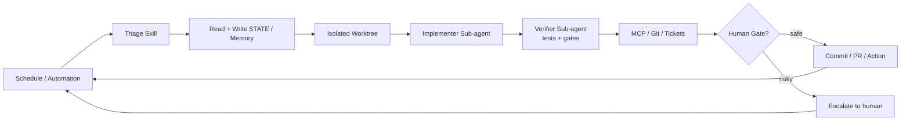

今天在 GitHub Trending 上看到一个有意思的项目：**Loop Engineering**，它提出了一个核心观点——Stop prompting, design the loop。与其每天反复编写和优化 Prompt，不如设计一套自动化循环系统，让 AI 工具自行运转，把工程师从重复性编码任务中真正解放出来。

## 一、项目概述

**Loop Engineering** 是由 Cobus Greyling 开发的一套面向 AI 编程工具（Agent）的系统性工程框架，适用于 Grok、Claude Code、Codex、Cursor、Opencode 等主流 AI 编码工具。

Boris Cherny（Anthropic Claude Code 负责人）说过：

> "I don't prompt Claude anymore. I have loops running that prompt Claude and figuring out what to do. My job is to write loops."

这正是 Loop Engineering 的核心思想：**杠杆点已从编写单次 Prompt 迁移到设计orchestrate agent 的控制系统**。

### 核心工具包

该项目维护了一整套 npm CLI 工具：

| 工具 | 作用 | 命令 |
|------|------|------|
| `loop-init` | 脚手架 + Loop Ready 评分 | `npx @cobusgreyling/loop-init . --pattern daily-triage --tool grok` |
| `loop-audit` | 循环就绪度评分（v1.6） | `npx @cobusgreyling/loop-audit . --suggest` |
| `loop-cost` | Token 消耗估算 | `npx @cobusgreyling/loop-cost --pattern daily-triage --level L1` |
| `loop-sync` | STATE.md 与 LOOP.md 漂移检测 | `npx @cobusgreyling/loop-sync .` |
| `loop-context` | 有状态记忆管理 + 熔断器 | `npx @cobusgreyling/loop-context --check --ledger run.json` |
| `loop-mcp-server` | MCP 运行时查询 | `npx @cobusgreyling/loop-mcp-server` |
| `loop-worktree` | git worktree 隔离执行 | `npx @cobusgreyling/loop-worktree create --run-id <id> --pattern <p>` |

## 二、技术原理

### 五大构建块 + 记忆

```
┌─────────────────────────────────────────────────┐
│         The Five Building Blocks + Memory        │
├──────────────┬──────────────────────────────────┤
│ 自动化/调度   │ 定时发现 + 分诊                    │
│ Worktree     │ 安全的并行执行隔离                   │
│ Skills       │ 持久化的项目知识                    │
│ 插件/连接器   │ MCP 打通真实工具                    │
│ 子 Agent     │ Maker / Checker 分工              │
│ + 记忆/状态   │ 跨会话持久化的核心骨架               │
└──────────────┴──────────────────────────────────┘
```

### 标准循环流程（Mermaid 表示）



关键设计理念：

- **Human Gate**：所有操作都有风险判断，危险操作自动升级人工审批
- **Worktree 隔离**：每个 fix attempt 运行在独立 git worktree 中，互不干扰
- **记忆外部化**：STATE.md / LOOP.md 作为跨会话持久化状态，不再依赖对话窗口
- **渐进式 L1→L2→L3**：week1 纯报告观察，week2 辅助修复，week3 无人值守

## 三、七大生产模式

| 模式 | 频率 | 适合场景 | Week1 推荐等级 |
|------|------|----------|---------------|
| Daily Triage | 1d~2h | 代码库日常清理 | **L1** |
| PR Babysitter | 5~15m | PR 状态监控 | L1（观察） |
| CI Sweeper | 5~15m | CI 失败自动排查 | L2（谨慎） |
| Dependency Sweeper | 6h~1d | 依赖更新 | L2（patch only） |
| Changelog Drafter | 1d 或 tag | 自动生成变更日志 | **L1** |
| Post-Merge Cleanup | 1d~6h | 合入后清理 | **L1** |
| Issue Triage | 2h~1d | Issue 分类处理 | **L1** |

交互式选择器：[https://cobusgreyling.github.io/loop-engineering/#interactive](https://cobusgreyling.github.io/loop-engineering/#interactive)

## 四、安装与快速开始

### 环境要求

- Node.js 18+
- npm
- Git
- 对应的 AI 编码工具（Grok / Claude Code / Codex / Cursor 等）

### 五分钟快速上手

```bash
# 1. 脚手架 + 获取 Loop Ready 评分（自动打印）
npx @cobusgreyling/loop-init . --pattern daily-triage --tool grok

# 2. 估算 Token 消耗
npx @cobusgreyling/loop-cost --pattern daily-triage --level L1

# 3. 审计改进建议
npx @cobusgreyling/loop-audit . --suggest

# 4. 可选：将 Loop Ready badge 嵌入 README
npx @cobusgreyling/loop-audit . --badge

# 5. 开始运行（第一周只报告，不自动修复）
/loop 1d Run loop-triage. Update STATE.md. No auto-fix in week one.
```

脚手架命令会在项目中生成 `LOOP.md`（循环定义）和 `STATE.md`（状态记录），并输出一个从 10 到 100 的 **Loop Ready Score**。

## 五、实际案例：Opencode + Daily Triage

以 `opencode` 工具 + `daily-triage` 模式为例，展示完整循环配置：

```bash
# 创建脚手架
npx @cobusgreyling/loop-init . --pattern daily-triage --tool opencode

# 生成的核心文件结构
.
├── LOOP.md              # 循环定义（谁做什么）
├── STATE.md             # 状态记录（上次做到哪）
├── budget.json          # Token 预算配置
├── run-log.json         # 运行日志
├── constraints.json     # 约束规则（denylist 等）
└── starters/
    └── daily-triage/
        └── opencode/
            └── loop.sh  # 循环执行脚本
```

Opencode 示例循环脚本：

```bash
#!/bin/bash
# loop.sh - Daily Triage for Opencode
opencode run "每天自动分诊 Issue：按标签分类，优先处理 bug 类型，
生成 STATE.md 中的今日摘要，包括：新增 Issue 数、待处理数、建议下一步。
本次不执行任何修改操作，仅生成报告。"
```

## 六、常见问题与注意事项

**Token 费用会爆炸吗？**
会。sub-agent + 高频循环 = 高昂 Token 账单。使用 `loop-cost` 工具在运行前估算消耗，并设置 `budget.json` 硬上限。

**自动化出错了怎么办？**
内置 Human Gate 设计确保危险操作不自动执行。另外 `loop-context` 提供了熔断器（circuit breaker），连续失败自动暂停循环。

**Comprehension Debt（理解债务）**
Loop 跑得越久，你对代码库的理解就越落后于它实际做的事。Addy Osmani 的建议是：*Build the loop. But build it like someone who intends to stay the engineer, not just the person who presses go.*

**Worktree 隔离的作用？**
防止多个循环任务同时修改同一分支导致冲突。每次 fix attempt 在独立的 git worktree 中执行，失败直接丢弃，不污染主分支。

## 七、总结

Loop Engineering 为 AI 编程工具提供了一套完整的设计方法论，从 Prompt 工程到系统工程的跨越。它的价值不仅在于省时，更在于：**把「谁来改」和「怎么改」的决策权从每次对话中抽离出来，变成可复用、可审计的自动化系统**。

如果你每天花超过 30 分钟在重复性的 AI Prompt 上，值得花 5 分钟跑一下 `loop-init`，看看你的 Loop Ready Score 是多少。

- 官网 & 交互式 Showcase：[https://cobusgreyling.github.io/loop-engineering/](https://cobusgreyling.github.io/loop-engineering/)
- 项目地址：[https://github.com/cobusgreyling/loop-engineering](https://github.com/cobusgreyling/loop-engineering)
- 深度 Essay：[https://cobusgreyling.substack.com/p/loop-engineering](https://cobusgreyling.substack.com/p/loop-engineering)
