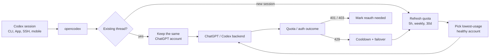

今天在 GitHub Trending 上看到一个有意思的项目：**opencodex**，它是一款通用 LLM 代理网关，可以让 OpenAI Codex 和 Claude Code 自由切换使用 Anthropic、Google、xAI、DeepSeek、GLM、Qwen、Ollama 等 40+ 提供商的模型，无需等待官方适配。

## 一、项目概述

opencodex 本质上是一个轻量级本地代理服务，运行在本地端口（默认 `localhost:10100`），负责将 Codex 的 Responses API 请求翻译为各个提供商所支持的协议格式。它的核心价值在于：

- **打破模型壁垒**：只需一条命令，就能让 Codex CLI/App/SDK 使用任何第三方大模型
- **保留原生体验**：Codex App 的模型选择器中会直接显示路由后的模型，并支持推理强度控制
- **多账户自动池化**：内置 ChatGPT/Codex 账号池，自动选择用量最低的健康账号，支持配额刷新和故障转移
- **跨平台支持**：macOS（launchd）、Linux（systemd）、Windows（Task Scheduler / 原生服务）均可运行

技术栈方面，opencodex 使用 **Node.js 18+** 作为运行时，**Bun** 运行时随包自动打包，无需用户单独安装。核心依赖仅有 `@bufbuild/protobuf`、`@modelcontextprotocol/sdk` 和 `zod`，代码量精简，结构清晰。

## 二、技术原理

### 2.1 协议适配层架构

opencodex 的核心是五个协议适配器（Adapter），每个对应一种主流 LLM 接口规范：

| 适配器 | 对应协议 | 代表提供商 |
|--------|----------|-----------|
| `anthropic` | Anthropic Messages API | Claude（Anthropic）|
| `google` | Google Gemini API | Gemini（Google）|
| `azure-openai` | Azure OpenAI API | Azure OpenAI |
| `openai-responses` | OpenAI Responses API | OpenAI 自身 |
| `openai-chat` | OpenAI Chat Completions（兼容）| 其余所有提供商 |

通过 `provider/model` 语法指定路由目标，例如：

```bash
# 使用 Anthropic 的 Claude Opus
codex -m "anthropic/claude-opus-4-8" "解释这个堆栈跟踪"

# 使用 Ollama Cloud 上的 GLM-5.2
codex -m "ollama-cloud/glm-5.2" "写一个 SQL 迁移"

# 使用本地 Ollama 的 llama3
codex -m "ollama/llama3" "重构这个函数"
```

### 2.2 会话亲和性（Session Affinity）

opencodex 为每个 Codex 会话线程（thread）绑定一个固定的账号。当一个会话在长时间 SSH、tmux 或移动设备连接中时，不会因账号池自动切换而被打断。新的会话则可以选择用量最低的账号进入，实现账号间的负载均衡。



### 2.3 Claude Code 集成

opencodex 不仅支持 Codex，还支持 Claude Code。通过 `ocx claude [args...]` 启动 Claude Code 时，代理会暴露 `/v1/messages` 接口（Anthropic Messages API），并通过网关模型发现机制在 Claude Code 的 `/model` 选择器中显示路由模型（格式为 `claude-ocx-<provider>--<model>`）。

### 2.4 安全注入机制

opencodex 通过修改 Codex 的 `openai_base_url` 配置将请求指向自身。对于本地安装，这一行配置是唯一的变化；远程/LAN 场景下则使用专用 provider entry（需要 API key header 认证），不会干扰本地线程历史。

历史恢复机制同样安全：`ocx stop` 时会将 Codex 历史记录恢复回原始提供商，opencodex 创建的线程会被标记 ejection，防止下次启动时意外重连到不存在的 provider。

## 三、安装与快速开始

### 3.1 环境要求

- **Node.js** >= 18（推荐使用 nvm/fnm 管理用户级 Node）
- 三端均支持：macOS、Linux、Windows（无需 WSL）

### 3.2 安装步骤

```bash
# 全局安装（Bun 运行时自动打包，无需单独安装）
npm install -g @bitkyc08/opencodex

# 交互式初始化（写入配置、注入 Codex、提供自动启动安装）
ocx init

# 启动代理
ocx start
```

如果遇到"bundled Bun runtime is missing"错误，说明安装脚本被跳过：

```bash
# 重新安装，放行脚本执行
npm install -g --allow-scripts=bun @bitkyc08/opencodex

# 使用 sudo 时保持 sudo 权限
sudo npm install -g --allow-scripts=bun @bitkyc08/opencodex
```

### 3.3 打开管理面板

```bash
ocx gui
# 浏览器打开 http://localhost:10100
```

在面板中：
1. 点击 **Add Provider**，从 40+ 内置提供商中选择或输入自定义 OpenAI 兼容端点
2. 粘贴 API Key（或通过 OAuth 登录 Anthropic、xAI、Kimi）
3. 模型列表从提供商的 `/v1/models` 端点自动发现，无需手动配置

### 3.4 Codex 代理安装（可选）

如果希望每次运行 `codex` 命令时自动启动代理：

```bash
ocx codex-shim install
```

### 3.5 系统服务安装（后台常驻）

| 操作系统 | 推荐方式 |
|----------|----------|
| macOS | `ocx service install`（launchd）|
| Linux | `ocx service install`（systemd 用户单元）|
| Windows | `ocx service install`（Task Scheduler，后台无窗口）或 `ocx service install --native`（原生服务）|

停止并恢复原生 Codex：

```bash
ocx stop   # 停止代理 + 恢复原生 Codex 配置
ocx restore  # 仅恢复配置，不停止代理
```

完整卸载：

```bash
ocx uninstall   # 停止代理、移除服务、恢复 Codex、删除 ~/.opencodex
npm uninstall -g @bitkyc08/opencodex
```

## 四、使用方法与实战

### 4.1 基础用法

安装配置完成后，直接使用 `codex` 命令即可：

```bash
# 默认使用配置的 defaultProvider
codex "用 Rust 写一个 Hello World"

# 指定提供商和模型
codex -m "google/gemini-3-pro" "为 auth.ts 写单元测试"

# 使用本地模型
codex -m "ollama/llama3" "重构这个函数"
```

### 4.2 进阶：模型路由与推理强度

路由后的模型在 Codex App 的模型选择器中直接可见，并支持 per-model 推理强度控制（low/medium/high/xhigh/max/ultra），opencodex 会根据上游支持情况透明映射。

GPT-5.6 Sol/Terra/Luna 已在目录中预置，当上游可用时会自动暴露。`ultra` 模式转换为 `max` 后发送给上游，确保兼容。

### 4.3 子代理委派（Multi-Agent）

opencodex 支持在 Codex 的子代理选择器中配置最多 5 个路由或原生模型。通过 `injectionModel` / `injectionEffort` 设置委派提示，通过 `injectionPrompt` 自定义措辞（支持 `{{model}}` / `{{effort}}` / `{{roster}}` 占位符）。

> 注意：当前原生父 agent 生成路由子 agent 时，请求体可能以加密形式到达上游 ([#92](https://github.com/lidge-jun/opencodex/issues/92))，建议在 v1 界面上使用跨提供商委派。

### 4.4 远程/LAN 访问配置

将代理绑定到 `0.0.0.0` 时必须配置认证令牌：

```bash
export OPENCODEX_API_AUTH_TOKEN="your-secret-token"
ocx start
```

所有请求需携带：

```
x-opencodex-api-key: your-secret-token
```

opencodex 使用常量时间比较，防止时序攻击。

## 五、常见问题与解决方案

### 5.1 安装后 "bundled Bun runtime is missing"

**原因**：npm 屏蔽了 postinstall 脚本（Bun 的运行时打包脚本被跳过）。

**解决方案**：

```bash
npm install -g --allow-scripts=bun @bitkyc08/opencodex
```

### 5.2 路由的 Claude 请求被 Anthropic 封号

**原因**：Anthropic 明确禁止通过第三方代理使用其 API。

**建议**：使用前查阅目标提供商的 ToS；推荐使用本地 Ollama 或支持合规访问的 OpenAI 兼容端点。

### 5.3 Codex App 不显示路由模型

**原因**：`ocx start` 后 Codex 配置未正确注入。

**解决**：

```bash
ocx ensure   # 启动代理（如需要）+ 刷新 Codex 配置/缓存
ocx sync     # 刷新模型列表并重新注入 Codex
```

### 5.4 模型 ID 中含斜杠（如 OpenRouter `provider/model`）

opencodex 自动将内部斜杠别名为 `-`（例如 `zenmux/moonshotai-kimi-k3-free` 别名为 `zenmux-moonshotai-kimi-k3-free`），路由时透明还原。

### 5.5 配置文件损坏

opencodex 检测到 JSON 解析错误时，会将原文件备份为 `config.json.invalid-<timestamp>` 并以默认配置启动，确保原始配置绝不丢失。

## 六、总结

opencodex 解决了一个非常实际的问题——**AI 编程工具的模型选择受限于官方适配速度**。通过将 Codex 的标准协议层抽离出来，变为可插拔的适配层，它让开发者可以在不同场景下自由切换性价比更高、能力更强或更符合本地合规要求的模型。

无论是想用 Claude 写代码、用 Gemini 做分析，还是在本地 Ollama 上跑一个私有化模型，opencodex 都提供了一条统一的技术路径。如果你正在使用 Codex 或 Claude Code，强烈建议尝试一下这个项目——也许它会成为你工具箱中最实用的那个 CLI 工具。
