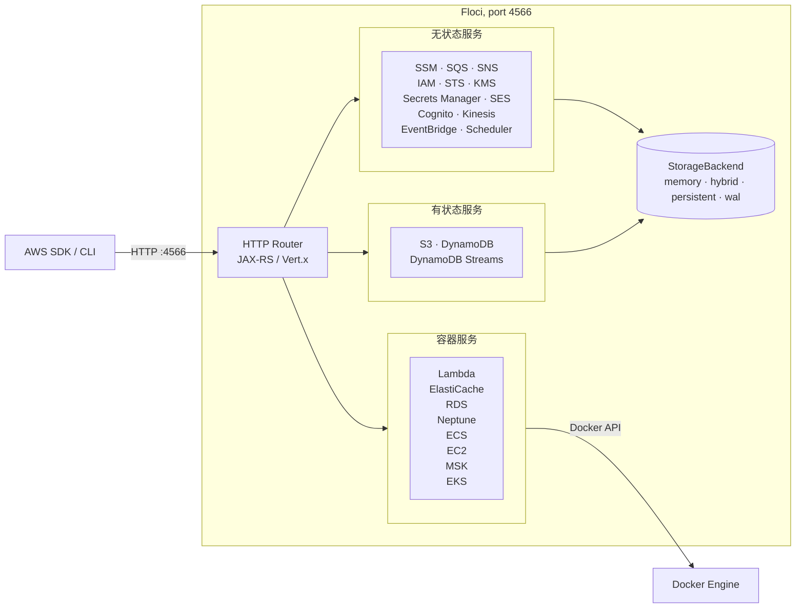

今天在 GitHub Trending 上看到一个有意思的项目：**Floci**，一个轻量级开源的 AWS 本地模拟器，主打快速、免费、无门槛，作为 LocalStack 社区版停止维护后的完美替代方案。

## 一、项目概述

Floci 是一个免费、开源的 AWS 本地模拟器，专为开发、测试和 CI 环境设计。它让你可以在本地运行 AWS 兼容的服务，无需云账户、无需认证令牌、无需付费功能限制。只需 `docker compose up`，即可启动。

### 核心特性

- **零门槛启动**：无账户、无认证令牌、无功能限制
- **快速轻量**：启动时间约 24 毫秒，空闲内存仅 13MB，Docker 镜像仅 90MB
- **广泛支持**：支持 69 种 AWS 服务
- **真实容器支持**：Lambda、RDS、Neptune、ElastiCache、MSK、ECS、EC2、EKS、OpenSearch、CodeBuild 等使用真实 Docker 容器而非浅层模拟
- **MIT 许可证**：完全免费、开源

## 二、技术原理

### 架构设计

Floci 采用 Quarkus 框架构建，基于 JAX-RS 和 Vert.x 实现高性能 HTTP 路由。整体架构分为三层：



### 核心技术栈

从 `pom.xml` 可以看出技术选型：

```xml
<quarkus.platform.version>3.36.3</quarkus.platform.version>
<jackson.version>2.21.4</jackson.version>
```

- **Quarkus**：云原生 Java 框架，支持原生镜像编译，启动快、内存小
- **Vert.x**：高性能异步事件驱动框架，处理大量并发连接
- **Jackson**：JSON 序列化与反序列化
- **Docker Java Client**：管理容器生命周期（Lambda、RDS 等）

### 存储后端设计

Floci 支持四种存储模式，适应不同场景：

| 模式 | 行为 | 适用场景 | 持久性 |
|---|---|---|:---:|
| `memory` | 全内存，停止即丢失 | CI 和临时测试 | 无 |
| `persistent` | 启动加载，写即刷盘 | 简单本地状态保存 | 中 |
| `hybrid` | 内存性能 + 5秒异步刷盘 | 本地开发 | 良好 |
| `wal` | 预写日志，最高可靠性 | 最高持久性要求 | 最高 |

## 三、安装与快速开始

### 环境要求

- Docker（用于容器服务）
- 可选：AWS CLI 或 SDK

### 安装方式

**方式一：CLI 工具（推荐）**

```bash
# 安装 Floci CLI
pip install floci-cli

# 启动
floci start

# 配置环境变量
eval $(floci env)
```

**方式二：Docker Compose**

```yaml
services:
  floci:
    image: floci/floci:latest
    ports:
      - "4566:4566"
    # 如需容器服务，挂载 Docker socket
    volumes:
      - /var/run/docker.sock:/var/run/docker.sock
```

```bash
docker compose up
```

### 最简运行示例

```bash
# 配置 AWS 环境变量
export AWS_ENDPOINT_URL=http://localhost:4566
export AWS_DEFAULT_REGION=us-east-1
export AWS_ACCESS_KEY_ID=test
export AWS_SECRET_ACCESS_KEY=test

# 创建 S3 存储桶
aws s3 mb s3://my-bucket

# 创建 DynamoDB 表
aws dynamodb create-table \
  --table-name demo-table \
  --attribute-definitions AttributeName=pk,AttributeType=S \
  --key-schema AttributeName=pk,KeyType=HASH \
  --billing-mode PAY_PER_REQUEST

# 列出表
aws dynamodb list-tables
```

## 四、使用方法与实战

### SDK 集成

**Python (boto3)**

```python
import boto3

client = boto3.client(
    "ssm",
    endpoint_url="http://localhost:4566",
    region_name="us-east-1",
    aws_access_key_id="test",
    aws_secret_access_key="test",
)

client.put_parameter(
    Name="/demo/app/message",
    Value="hello from floci",
    Type="String",
    Overwrite=True,
)

response = client.get_parameter(Name="/demo/app/message")
print(response["Parameter"]["Value"])
```

**Node.js (AWS SDK v3)**

```javascript
import { SQSClient, SendMessageCommand } from "@aws-sdk/client-sqs";

const client = new SQSClient({
  endpoint: "http://localhost:4566",
  region: "us-east-1",
  credentials: { accessKeyId: "test", secretAccessKey: "test" },
});

await client.send(
  new SendMessageCommand({
    QueueUrl: "http://localhost:4566/000000000000/demo-queue",
    MessageBody: "hello from floci",
  }),
);
```

**Java (AWS SDK v2)**

```java
var client = DynamoDbClient.builder()
    .endpointOverride(URI.create("http://localhost:4566"))
    .region(Region.US_EAST_1)
    .credentialsProvider(StaticCredentialsProvider.create(
        AwsBasicCredentials.create("test", "test")))
    .build();

client.createTable(b -> b
    .tableName("demo-table")
    .billingMode(BillingMode.PAY_PER_REQUEST)
    .attributeDefinitions(
        AttributeDefinition.builder().attributeName("pk").attributeType(ScalarAttributeType.S).build())
    .keySchema(
        KeySchemaElement.builder().attributeName("pk").keyType(KeyType.HASH).build()));

System.out.println(client.listTables().tableNames());
```

### Testcontainers 集成

Floci 提供多语言 Testcontainers 模块，适合隔离测试：

**Java**

```xml
<dependency>
    <groupId>io.floci</groupId>
    <artifactId>testcontainers-floci</artifactId>
    <version>1.4.0</version>
    <scope>test</scope>
</dependency>
```

```java
@Testcontainers
class S3IntegrationTest {
    @Container
    static FlociContainer floci = new FlociContainer();

    @Test
    void shouldCreateBucket() {
        S3Client s3 = S3Client.builder()
                .endpointOverride(URI.create(floci.getEndpoint()))
                .region(Region.of(floci.getRegion()))
                .credentialsProvider(StaticCredentialsProvider.create(
                        AwsBasicCredentials.create(floci.getAccessKey(), floci.getSecretKey())))
                .forcePathStyle(true)
                .build();

        s3.createBucket(b -> b.bucket("my-bucket"));
    }
}
```

**Python**

```bash
pip install testcontainers-floci
```

```python
import boto3
from testcontainers_floci import FlociContainer

def test_s3_create_bucket():
    with FlociContainer() as floci:
        s3 = boto3.client(
            "s3",
            endpoint_url=floci.get_endpoint(),
            region_name=floci.get_region(),
            aws_access_key_id=floci.get_access_key(),
            aws_secret_access_key=floci.get_secret_key(),
        )
        s3.create_bucket(Bucket="my-bucket")
```

### 从 LocalStack 迁移

Floci 是 LocalStack Community 的直接替代品，端口、凭证、SDK 配置完全兼容：

```yaml
# 替换镜像即可
# 之前
image: localstack/localstack

# 之后
image: floci/floci:latest
```

环境变量自动转换：

| LocalStack | Floci 等价 |
|---|---|
| `LOCALSTACK_HOST` | `FLOCI_HOSTNAME` |
| `PERSISTENCE=1` | `FLOCI_STORAGE_MODE=persistent` |
| `LAMBDA_DOCKER_NETWORK` | `FLOCI_SERVICES_LAMBDA_DOCKER_NETWORK` |
| `DEBUG=1` | `QUARKUS_LOG_LEVEL=DEBUG` |

## 五、常见问题与解决方案

### 端口冲突

**问题**：4566 端口被占用

**解决**：通过环境变量指定其他端口

```bash
export FLOCI_PORT=14566
```

### 容器服务无法启动

**问题**：Lambda、RDS 等容器服务报错

**解决**：确保挂载了 Docker socket

```yaml
services:
  floci:
    image: floci/floci:latest
    ports:
      - "4566:4566"
    volumes:
      - /var/run/docker.sock:/var/run/docker.sock
    user: root  # 某些系统需要
```

### 多容器环境下 URL 解析错误

**问题**：应用容器访问 Floci 返回的 URL（如 SQS QueueUrl）无法解析

**解决**：设置 `FLOCI_HOSTNAME` 为服务名

```yaml
services:
  floci:
    image: floci/floci:latest
    ports:
      - "4566:4566"
    environment:
      - FLOCI_HOSTNAME=floci

  my-app:
    environment:
      - AWS_ENDPOINT_URL=http://floci:4566
    depends_on:
      - floci
```

### 数据持久化

**问题**：重启后数据丢失

**解决**：使用持久化存储模式

```yaml
environment:
  - FLOCI_STORAGE_MODE=persistent
  - FLOCI_STORAGE_PERSISTENT_PATH=/data
volumes:
  - ./data:/data
```

## 六、总结

Floci 作为 LocalStack 社区版停止维护后的开源替代方案，凭借其轻量、快速、无门槛的特点，非常适合本地开发和 CI 环境使用。相比 LocalStack，Floci 具有以下优势：

- **无需认证令牌**：开箱即用
- **安全更新持续**：LocalStack 社区版已冻结安全更新
- **启动快 100 倍**：24ms vs 3.3s
- **内存占用小 10 倍**：13MB vs 143MB
- **镜像体积小 10 倍**：90MB vs 1GB
- **MIT 许可证**：无使用限制

如果你的项目依赖 AWS 服务进行本地开发或测试，Floci 值得一试。
