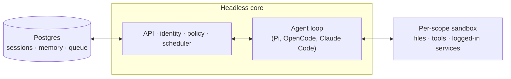

今天在 GitHub Trending 上看到一个有意思的项目：**QM**，一个专为初创公司设计的多智能体（Multi-Agent）协作平台，支持在 Slack 和网页中共享记忆、文件、凭证和工作流，每个成员拥有独立隔离的工作空间，同时又能跨渠道高效协作。

## 一、项目概述

QM 的核心理念是"个人与共享共存"。大多数 AI 智能体产品被设计成个人助理，而 QM 反其道而行——**为整个公司或团队构建一个共享的智能体枢纽**。员工每人拥有独立隔离的工作空间，互不干扰；同时可以在 Slack 频道、项目群聊中与智能体协作，所有上下文自动隔离，互不泄露。

### 核心特性

- **个人与共享双重作用域**：每个用户、每个房间（频道）都有独立的记忆、文件、凭证、权限、定时任务和沙盒环境，既保证个人定制，又支持团队协作
- **Slack 与网页统一身份**：同一套身份和配置在 Slack 和网页 App 之间无缝切换
- **多模型驱动**：内置 Pi、OpenCode、Codex、Claude Code 等多种 Harness 接口，部署不绑定任何单一供应商
- **共享 Skills 机制**：Skills 归 scope 所有，可按权限共享，管理员可将其推广为全组织可用
- **后台任务**：内置 Crons 和 Watches，支持定时执行和文件监控触发
- **内置安全策略**：三种安全姿态（Strict / Auto / Dangerous），企业可按需配置

## 二、技术架构

### 整体架构



QM 的架构分为三个核心层：

1. **Headless Core**：基于 Node.js + TypeScript 的无头核心，HTTP API 提供身份、策略和调度能力，Agent Loop 通过统一接口驱动多种模型
2. **Per-scope Sandbox**：每个作用域（Scope）拥有独立的文件系统、工具和已登录服务，数据完全隔离
3. **Postgres 持久层**：存储用户数据、会话历史和其他持久状态，支持 pg-boss 任务队列

### 技术栈选型

| 组件 | 技术选型 |
|------|----------|
| 核心运行时 | Node.js ≥24.15，TypeScript（Erasable Syntax） |
| HTTP 框架 | Fastify 5.x |
| Slack 集成 | @slack/bolt |
| 网页前端 | Vite + Lit Web Components |
| 数据库 | PostgreSQL + pg-boss（任务队列） |
| Agent 接口 | Pi、OpenCode、Codex、Claude Code |
| 类型安全 | TypeScript strict + Zod 4 + TypeBox |
| 密钥管理 | AWS Secrets Manager / AWS S3 |

核心配置通过 `loadConfig()` 统一读取，所有 `process.env` 在边界处只解析一次，然后以依赖注入的方式传递下去，ESLint 规则强制禁止模块内直接访问 `process.env`：

```typescript
// eslint.config.mjs 强制规则示例
{
  "selector": "MemberExpression[object.name='process'][property.name='env']",
  "message": "Read configuration through loadConfig() (src/config.ts) and pass it down — process.env is parsed exactly once at the boundary."
}
```

### 安全策略模型

QM 支持三种安全姿态，由组织管理员统一设置，scope 可以收紧但不能放宽：

| 姿态 | 行为 |
|------|------|
| **Strict** | 所有 Harness 工具调用暂停等待人工审批，只有无副作用的 Turn Enders 除外 |
| **Auto**（默认） | 分类器对来源标记的外部数据和工具结果进行内容审查，可对接企业自建审查代理 |
| **Dangerous** | 不进行内容审查，工具调用之间无暂停 |

此外，所有作用域均执行**预声明命令策略**——对递归删除、危险 SQL 等操作进行规则审批和硬性拒绝，即使在 Dangerous 姿态下也生效。

## 三、安装与快速开始

### 环境要求

- Node.js ≥ 24.15.0
- npm ≥ 11.10.0
- PostgreSQL 数据库
- Slack App（可选）

### 创建组织部署

```bash
# 通过 npm 初始化 QM 组织部署
npm exec --yes --package=@yc-software/qm@latest -- \
  qm init . --org <your-org-slug> --target <fly-or-aws>
npm install
```

初始化流程涵盖基础设施配置、Web 登录、连接器凭证、Slack 访问（可选）、部署和在线验证，**无需检出源码**。

### 本地开发

```bash
# 克隆并进入项目
git clone git@github.com:yc-software/qm.git
cd qm

# 安装依赖
npm install

# 启动开发服务（热重载）
npm run dev
```

### 运行测试

```bash
# 单元测试
npm test

# 端到端测试
npm run test:e2e

# PostgreSQL 相关测试（需本地 PG）
npm run test:pg
```

## 四、使用方法与实战

### 在 Slack 中与智能体协作

QM 的 Slack 插件在内核进程内启动和管理，通过 Socket Mode 建立连接。在配置好的 Slack 频道中，成员可以直接 @ 智能体提问，智能体会基于该频道的独立记忆和上下文进行回答：

- 智能体拥有该频道的独立记忆视图
- 所有文件操作、凭证访问都在频道级别的沙盒中进行
- 管理员可设置频道白名单，限制特定模型或工具的使用

### 内部应用构建

QM 支持在作用域内构建和发布自定义内部 Web 应用：

```bash
# 在你的 scope 沙盒中安装应用模板
qm deploy app my-internal-tool --scope personal

# 发布到指定人员或团队
qm publish my-internal-tool --to @alice --to #engineering
```

### 定时任务与后台监控

使用内置 Crons 配置定期任务：

```javascript
// 在 qm.config.ts 中定义
export const crons = [
  {
    name: "daily-digest",
    schedule: "0 9 * * *",  // 每天早上 9 点
    handler: async (ctx) => {
      const unread = await ctx.tools.email.listUnread();
      await ctx.notify("📬 您有 " + unread.length + " 封未读邮件");
    }
  }
];
```

## 五、常见问题与解决方案

**Q: 初始化时报 `qm: command not found`？**

确保 `@yc-software/qm` 已通过 `npm exec` 正确解析，或将 `node_modules/.bin` 加入 PATH。也可以使用 `npx @yc-software/qm init` 代替。

**Q: 如何切换使用的模型？**

在部署目录的 `qm.config.ts` 中修改 `harness.default`，支持 `pi`、`opencode`、`codex`、`claude-code` 四种选项。

**Q: Strict 模式下工具调用无响应？**

Strict 姿态要求每次工具调用前人工审批，检查 Slack 或 Web UI 中是否有待处理的审批通知，管理员可在仪表板批量审批。

**Q: 私有仓库如何部署？**

QM 建议使用**私有 Fork**（而非 GitHub Fork），避免继承公开仓库的对象网络和可见性限制。官方推荐的工作流：

```bash
# 创建私有镜像仓库
gh repo create <org>/qm-private --private

# 克隆为裸仓库后推送
git clone --bare git@github.com:yc-software/qm qm-seed.git
git -C qm-seed.git push --mirror git@github.com:<org>/qm-private
```

**Q: PostgreSQL 连接失败？**

确认 `.env` 中 `DATABASE_URL` 格式正确，且数据库版本 ≥ 14。QM 的 pg-boss 依赖 `pg_notify`，需确保 PostgreSQL 配置中 `listen_addresses` 包含你的连接地址。

## 六、总结

QM 是一个架构清晰、定位明确的企业级 Multi-Agent 协作平台。它通过**作用域隔离**解决了个体与团队之间的上下文冲突，通过**多模型抽象**避免了供应商锁定，通过**统一的安全策略**兼顾了灵活性与合规性。如果你正在为团队构建 AI 协作基础设施，QM 值得深入研究——尤其是其源码中对 TypeScript 严格模式、配置注入和安全模型的设计实践。
