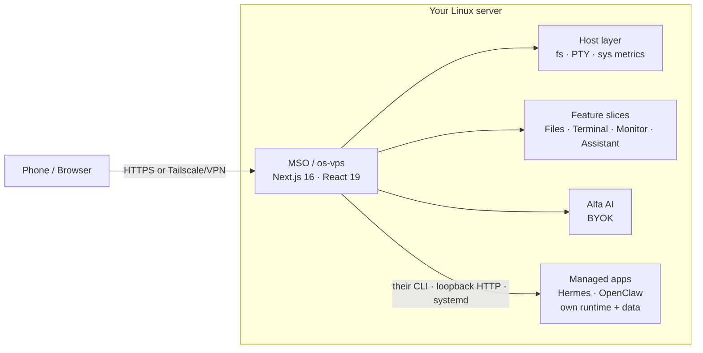

**开篇引导段**（1-2句，介绍项目背景，不可跳过，不可出现 `#` 标题）：
今天在 GitHub Trending 上看到一个挺有意思的项目：**Manef Shell OS（MSO）**，它想把「在手机上修服务器」这件原本很痛苦的事，变成打开一个浏览器标签页那么简单。

## 一、项目概述

**Manef Shell OS**（在 UI 里简称 **MSO**）是一个开源、移动优先的 Linux 服务器可视化外壳（visual shell）。它把真实终端、文件管理器、实时系统指标和一个 BYOK（Bring Your Own Key）AI 助手，整合进一个你完全私有掌控的浏览器工作区——而且不需要跑一整套远程桌面。

需要明确的是，MSO **不是一个操作系统、Linux 发行版、桌面环境或 VPS 服务商**。它以一个普通的 **非 root Node 进程** 跑在你的 Linux 上，目前处于 **Public Alpha / Developer Preview** 阶段，尚未经过第三方安全审计。

它的核心卖点可以概括为一句话：**「你的 Linux 服务器，终于能在手机上用了。」** 典型场景包括：

- 半夜被报警叫醒，不用开笔记本，掏出手机就能看系统健康度、开终端、查日志、重启服务；
- 不记得每条 shell 命令也能可视化地浏览、上传、重命名、预览、编辑文件；
- 把终端、文件、指标、浏览器、AI 放在同一个工作区里，不再在多个运维工具间反复横跳。

核心能力分成三块：

- **Control**：交互式 PTY 终端（`vim`、`top`、`ssh` 都能跑）、文件管理（浏览/上传/搜索/预览/重命名/移动/复制/压缩/删除，限定在配置好的文件系统根目录内）、实时系统监控（CPU/内存/磁盘/网络/进程/uptime）、对同机其他应用（如 Hermes、OpenClaw）的启停与状态备份。
- **Work**：内置代码/文本编辑器、浏览器预览、媒体查看（图片/音频/视频/PDF）。
- **Extend**：BYOK 的 Alfa AI 助手、模块化的 `frontend/slices/<slug>/` 功能切片、可个性化为 macOS/Windows/iOS/Android 风格的界面布局。

## 二、技术原理

### 2.1 整体架构

MSO 是一个 **单一的 Next.js 应用**，作为非 root Node 进程运行在你的服务器上。应用通过本地服务端路由访问宿主机能力，功能以垂直切片（vertical slices）的形式组织。



技术栈很新：`Next.js 16`、`React 19`、`pnpm@10.32.1`、`Node >= 20.9`，终端能力依赖原生插件 `node-pty`。在 `package.json` 里可以印证：

```json
{
  "name": "os-vps",
  "version": "0.2.0",
  "engines": { "node": ">=20.9" },
  "packageManager": "pnpm@10.32.1",
  "dependencies": {
    "next": "^16.2.7",
    "react": "^19.2.7",
    "node-pty": "^1.1.0"
  }
}
```

`node-pty` 是原生 addon（`.node` 二进制），必须在运行时从 `node_modules` `require()`，绝不能打包进 bundle，否则 binding 加载会失败——这也是 `next.config.mjs` 里 `serverExternalPackages: ["node-pty"]` 的原因。

### 2.2 被「安全」反向设计的中间件

最能体现项目工程素养的，不是功能本身，而是它那套「偏执」的中间件网关。整个 `proxy.ts` 几乎是为「防止一个浏览器远程 shell 变成未授权中继」而生的，几个关键设计点：

**多源 vs 单源模式**。当配置了 `NEXT_PUBLIC_MANAGED_APP_HOST_TEMPLATE`（如 `{id}.os.rahmanef.com`）时进入「split origin」模式：每个托管应用拥有独立源（origin），被管理应用的 dashboard 从自己的主机名提供。这堵死了「被框住的 dashboard 因同源而能调用宿主 API」的越权路径。

**WebSocket 升级的严格校验**。托管应用（OpenClaw/Hermes）的网关 socket 是唯一一条「中间件即全部防线」的路径——upgrade 请求不会到达 proxy 路由，于是 `verifyAuth()` 不会执行。因此中间件必须亲自验证 HMAC 签名、设备批准状态，并拒绝任何指向非本机回环地址（off-box）的转发：

```ts
// proxy-websocket.test.ts 节选：环境 typo 绝不能把它变成开放中继
it("refuses to relay off-box when the gateway env points somewhere public", async () => {
  vi.stubEnv("OPENCLAW_DASHBOARD_URL", "http://10.0.0.9:18789");
  const res = await proxy(upgradeReq("openclaw.os.rahmanef.com", "/", session()));
  expect(res.status).toBe(404);
});
```

**Camoufox VNC 桥的安全史**。noVNC over websockify 在 x11vnc 之前，曾因为唯一的闸门是「检查名为 session 的 cookie 是否存在（任何值都满足）」而被硬 403。重新开放后，它严格校验签名、设备批准，并拒绝指向 off-box 的目的地——测试用例里那个 `Cookie: session=anything` 的请求曾经能直达 websockify，现在被 404。

**CSRF depth-2**。对会改状态的 `/api` 请求，跨站（cross-site）和同站（same-site，cockpit 与 app host 共享注册域，所以 cockpit JS 探进来算 same-site）的变更请求一律 403，GET 读取则放行。

**会话 cookie 的收窄**。session cookie 被放大到 `Domain=os.rahmanef.com`，所以命名空间内任何未认领的主机都必须 404，否则「加一条 DNS 记录」就能白送一个完全已认证的 cockpit。

### 2.3 与同类工具的定位

| | **MSO** | Cockpit | ttyd | FileBrowser | Netdata | Tailscale SSH |
|---|:---:|:---:|:---:|:---:|:---:|:---:|
| 产品成熟度 | 早期 alpha | 成熟 | 各异 | 成熟 | 成熟 | 成熟 |
| 移动优先界面 | 是 | 部分 | 各异 | 部分 | 部分 | 非重点 |
| 真实 PTY | 是 | 是 | 是 | 否 | 否 | 是 |
| 文件管理器 | 是 | 部分 | 否 | 是 | 否 | 否 |
| 内置 AI | 是（BYOK） | 否 | 否 | 否 | 否 | 否 |
| 服务/包管理 | 基础 | 强 | 非重点 | 非重点 | 监控导向 | 仅 SSH |

MSO 的目标不是取代每个专业工具，而是把最常用的那几个能力收拢到一个移动友好的工作区里。

## 三、安装与快速开始

### 3.1 环境要求

- 已测试：Ubuntu 22.04 / 24.04；预期可用：Debian 12 及多数 systemd + Node 20.9+ 的发行版。
- **不支持**：Windows/macOS 作为宿主机、非 systemd 主机的自动服务安装、root 部署。

### 3.2 一键安装

在你的服务器上用普通用户（**不要 root**）执行：

```bash
curl -fsSL https://raw.githubusercontent.com/rahmanef63/os-vps/main/scripts/install.sh | bash
```

安装脚本会一次性完成：安装前置依赖、构建 MSO、生成本地凭据、配置 `os-vps.service` systemd 单元。安装器会打印一次首次登录密码，并说明如何批准你的第一台浏览器设备。

常用参数：

```bash
# 自定义端口
curl -fsSL https://raw.githubusercontent.com/rahmanef63/os-vps/main/scripts/install.sh | bash -s -- --port 4005
# 不注册 systemd 服务
curl -fsSL https://raw.githubusercontent.com/rahmanef63/os-vps/main/scripts/install.sh | bash -s -- --no-service
# 卸载
curl -fsSL https://raw.githubusercontent.com/rahmanef63/os-vps/main/scripts/install.sh | bash -s -- --uninstall
```

### 3.3 本地开发

```bash
pnpm install
cp .env.example .env.local
pnpm dev
```

质量门禁齐备：`pnpm typecheck` / `pnpm lint` / `pnpm test` / `pnpm check` / `pnpm build`，并把包管理器锁死为 `pnpm@10.32.1` 以保证 `node-pty` 原生构建路径可预测。

## 四、使用方法与实战

### 4.1 真实部署拓扑

**千万不要把原始 app 端口直接暴露到公网。** 正确的姿势是把它放在 Tailscale / VPN / 带严格访问控制的 TLS 反向代理之后：

- 用专用非 root 用户运行；
- 优先 Tailscale 或 VPN，否则用 HTTPS + 严格防火墙或 allowlist；
- 设置足够强的 `OS_SESSION_SECRET` 与 `OS_LOGIN_PASSWORD`；
- 用 `OS_FS_WRITE_ROOTS` 收紧可写根目录。

### 4.2 从手机修一次线上故障

1. 在手机浏览器打开你的私有域名（如 `os.rahmanef.com`），用批准的设备和登录密码进入；
2. 打开 **System Monitor** 切片，看 CPU/内存/磁盘/网络实时曲线，定位是哪块在飙；
3. 打开 **Terminal** 切片，直接 `vim` 改配置、`systemctl restart xxx` 重启服务、`journalctl -u xxx -f` 看日志；
4. 在 **Files** 切片里可视化地定位、预览、上传替换配置或资源文件，无需记住每条命令。

### 4.3 把同机其他应用收编进来

MSO 能检测、启停、查看健康度与版本、拉取日志，并对你已经运行的独立应用（Hermes、OpenClaw）做状态备份——通过它们各自的 CLI 和 systemd 单元驱动。每个应用的 dashboard 在自己的窗口里打开；给每个应用配独立主机名，它就会从自己的源提供（opt-in，两个环境变量）。关键安全提示：被框住的 dashboard 需要 `allow-same-origin`，否则会与 cockpit 同源、能用你的会话调用宿主 API——所以必须把每个托管 app 的 dashboard 从各自的主机名提供。

### 4.4 用 Alfa AI 辅助运维

Alfa 是 BYOK 的 tool-calling 智能体（不是聊天机器人）。12 个工具无需确认即可运行（`fs.list`、`fs.read`、`fs.search`、`sys.stats`、`sys.processes`、`apps.list`、`app.open`、`skills.list`、`skills.read`、`memory.remember`、`memory.forget` 等）；6 个会弹出 Approve/Deny 卡片展示确切调用（`fs.write`、`fs.mkdir`、`fs.move`、`fs.copy`、`fs.delete`、`exec.run`）。**重要**：Alfa 读取的任何文件内容、命令输出都会被发往你的模型供应商，并在同一轮后续每个回合重新发送；`exec.run` 不做沙箱隔离，wd 被限制在你的可写根目录，但命令本身以服务用户身份跑在你的登录 shell 里。务必在 Approve 卡片上看清具体命令，而不是看 Alfa 的摘要。

## 五、常见问题与解决方案

**Q1：安装脚本一定要 root 跑吗？**
不要。应以普通服务器用户运行，安装器会在非 root 下完成构建并注册 systemd 单元；root 部署明确不被支持。

**Q2：能直接把 3000/4005 端口映射到公网吗？**
不能。一个已认证的 MSO 会话拥有进程所属用户的文件读权限与命令执行权限，应「像浏览器里的 SSH 一样」对待它。务必放在 Tailscale/VPN 或受保护的反向代理之后。

**Q3：Alfa 读了我服务器上的文件，数据会不会泄露？**
BYOK 只意味着密钥在你手里，不意味着数据留在盒子里。Alfa 读取的文件内容、命令输出都会发往你的模型供应商。把 Alfa 读到的任何文件都当作不可信输入，永远以 Approve 卡片上的确切命令为准。

**Q4：支持 Windows / macOS 宿主机吗？**
目前不支持作为宿主机，也不支持非 systemd 主机的自动服务安装。已测试 Ubuntu 22.04/24.04，预期 Debian 12 及多数 systemd + Node 20.9+ 发行版可用。

**Q5：多用户 / 第三方安全审计？**
当前为单用户、无第三方安全审计的早期 alpha。对安全合规有硬性要求的生产环境请谨慎评估，等待项目成熟与审计。

## 六、总结

Manef Shell OS 把一个长期「能用但不好用」的运维场景——手机上管 Linux 服务器——做成了体验顺滑的浏览器工作区。它的技术选型（Next.js 16 + React 19 + 原生 PTY）很现代，而真正让人眼前一亮的，是整套为「浏览器远程 shell 不该变成未授权中继」反复加固的中间件安全设计：签名校验、设备批准、off-box 转发拒绝、CSRF depth-2、源隔离一应俱全，且都有测试用例兜底。

当然，项目本身坦诚标注为 Public Alpha、未审计、单用户、早期——生产环境直接裸奔公网是危险的。把它放在 Tailscale 或受保护的反代之后，作为个人/小团队「随时掏手机修服务器」的 cockpit，是目前最合适的使用方式。如果你本来就想要一个移动优先、带内置 AI、能拢起终端/文件/监控的服务器控制台，MSO 值得保持关注。

> 项目地址：<https://github.com/rahmanef63/os-vps> ｜ 许可证：MIT
