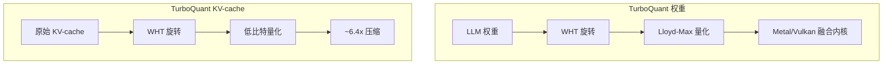

今天在 GitHub Trending 上看到一个有意思的项目：**Atomic Agent**，一个本地优先的 AI Agent 运行时——控制循环和全部状态都跑在你自己的机器上，支持本地模型或云端模型，真正实现数据不离开本机。

## 一、项目概述

Atomic Agent 由 AtomicBot-ai 团队开发，是一个运行在本地的 AI Agent 框架，能够驱动浏览器、编辑文件、执行已批准的 shell 命令、记忆跨会话上下文，并支持 MCP 协议扩展。最大的亮点是：**一切控制在本地，无 API 费用，数据永不外流**。

### 核心特性

- **本地优先**：控制循环和所有状态都在本地运行，Session、Memory、Tasks、Traces、Skills、浏览器配置和 config 都存在本地 SQLite 和文件里
- **TurboQuant 加速**：团队自研的 llama.cpp 分支（WHT 旋转低比特量化），KV-cache 压缩最高 6.4 倍，配合 Metal decode kernel
- **GAIA L1 基准领先**：在 53 个公开 GAIA L1 任务中达到 69.8% 准确率，超越 Hermes 的 58.5%，平均每任务耗时仅 ~217 秒
- **极小的模型也能跑**：qwen-3.5-9b（Q4_K_M）达到 52.8% 准确率，gemma-4-12b 达到 45.3%，真正让消费级 GPU 发挥作用
- **全工具链覆盖**：浏览器自动化、Web 搜索、文件系统、Shell、桌面通知、文档提取、Git（只读）、Memory、Tasks、Skills、MCP

## 二、技术原理

### Agent Loop 架构

Atomic Agent 的核心是一个高效的 Agent Loop，四个步骤循环执行：


1. **Prompt**：向本地模型发送紧凑提示词
2. **Decide**：模型返回 JSON 格式的工具调用数组（GBNF 语法约束，格式始终合法）
3. **Run**：核心执行工具调用；独立只读调用可并行，危险操作需审批
4. **Compress**：结果和状态被压缩摘要，而不是完整回填到 prompt

这种设计的关键在于：**一次推理产生一次工具调用，执行后压缩结果，避免了传统方案中 context 无限膨胀的问题**。

### TurboQuant 技术栈



- **KV-cache 量化**：WHT 旋转低比特量化，压缩比约 6.4 倍，显存占用大幅降低
- **权重量化**：Lloyd-Max 量化 + WHT 旋转，配合 Metal/Vulkan 融合内核保证质量
- **投机解码**：内置 Gemma 4 MTP 和 Qwen 3.6 NextN 投机头，无需二次加载模型，吞吐提升 30-50%

### 稳定前缀与外部化状态

Small models 能跑满多步任务的关键在于两点：

```typescript
// 稳定前缀：persona、rules、tools、skills、capabilities、instructions
// 在同一 session 内 byte-stable → 支持 cache_prompt / slot_id 复用 KV-cache

// 外部化状态：session、memory、tasks、skills、traces、browser snapshot、model config
// 全部存在 prompt 外部，prompt 只持有紧凑指针
```

这是 Atomic Agent 能让 9B 模型在 GAIA L1 达到 52.8% 的核心原因。

## 三、安装与快速开始

### 环境要求

- Node.js ≥ 25.7（发布版本为 SEA 二进制，可独立运行）
- `llama-server`（可由 CLI 自动管理，也可外部提供）
- Chrome / Microsoft Edge / Chromium（浏览器自动化用，不捆绑）
- macOS / Linux x64 / Windows x64

### 一键安装

macOS / Linux：

```bash
curl -fsSL https://atomicagent.io/install | sh
```

Windows PowerShell：

```powershell
irm https://atomicagent.io/install.ps1 | iex
```

安装器自动下载 release 包、校验 SHA256、安装 CLI 及 support assets（grammars、native prebuilds、bundled ripgrep）。

### 使用 llama-server 托管模式

```bash
# CLI 自动管理 llama-server
atomic-agent models update
atomic-agent models list
atomic-agent models pull qwen-3.5-9b
atomic-agent models use qwen-3.5-9b
atomic-agent models start

# 启动交互式 TUI
atomic-agent tui --cwd /path/to/work
```

### 外部 llama-server（已有现成服务）

```bash
export ATOMIC_AGENT_LLAMA_URL=http://127.0.0.1:8080

./llama-server -m Qwen3.5-9B-Q4_K_M.gguf \
  --slots 4 --parallel 4 --port 8080 --cache-reuse 256

atomic-agent tui --cwd /path/to/work
```

## 四、使用方法与实战

### TUI 交互模式

```bash
# 进入 TUI 控制台
atomic-agent tui --cwd /path/to/work

# 简单单次会话
atomic-agent run --cwd /path/to/work
```

TUI 提供：审批面板、日志、模型切换、Skills、Tasks、Memory、MCP 配置、Telegram 和 Trace 回放。

### HTTP 服务模式（API 集成）

```bash
atomic-agent serve \
  --host 127.0.0.1 \
  --port 8787 \
  --cwd /path/to/work \
  --api-key "$ATOMIC_AGENT_API_KEY"
```

`POST /v1/chat/completions` 将一次请求映射为完整的 macro-turn：`user → 0..N tool steps → reply`，一个请求完成完整的多步任务。

### Memory 系统

Memory 不是简单聊天日志回填，而是结构化的本地存储：

| 类型 | 用途 |
|---|---|
| Profile Facts | 版本化的事实，带关键词门控查询 |
| Notes | SQLite + FTS5 + embedding 混合召回 |
| Links | 相关记忆的有界图连接 |
| Lessons | 从重复事件提炼出的可复用原则 |
| Procedures | how-to 模板（不自动执行） |
| Voting | 记忆有用性投票，自动去重和淘汰 |

Reflection 在每次 turn 后台运行，不阻塞主回复流。

### Skills 系统

内置 17 个 Starter Skills（Docker、GitHub、Notion、Obsidian、PDF 等），首次运行自动安装。可通过 Markdown 编写自定义 Skill，脚本执行需审批。

### Telegram 远程控制

```jsonc
// <stateDir>/config.json
{ "telegram": { "enabled": true, "ownerUserId": null } }
```

```bash
# <stateDir>/.env
TELEGRAM_BOT_TOKEN=123456789:AA-your-bot-token
```

审批以 Inline Button 形式推送到你的 Telegram DM，真正实现手机远程控制本地 Agent。

## 五、常见问题与解决方案

**Q: 安装后提示 `llama-server` 找不到？**
A: 运行 `atomic-agent models start` 让 CLI 自动启动管理服务，或配置 `ATOMIC_AGENT_LLAMA_URL` 指向外部服务。

**Q: 浏览器自动化失败（macOS）？**
A: 需要在系统设置中授权：Accessibility、Screen Recording、Automation 权限。参考 TUI 左下角权限引导。

**Q: GPU 加速不生效？**
A: Intel/AMD 需安装 `mesa-vulkan-drivers`；NVIDIA 用自带驱动。`atomic-agent models use-device auto` 自动选择。

**Q: 模型精度低（3B/7B）效果不好？**
A: 这是预期行为。Atomic Agent 的设计让小模型在多步任务中尽可能有用（9B 可达 52.8%），但无法弥补模型本身能力上限。

## 六、总结

Atomic Agent 解决了一个核心矛盾：**本地模型的 context 有限、显存有限，怎么跑好多步 Agent 任务？** 答案在于四点：压缩 prompt 稳定前缀、外部化全部状态、KV-cache 低比特量化、工具调用结果摘要压缩。这套组合拳让消费级 GPU 上的 9B~35B 模型真正有了实用价值。

如果你想：
- 完全掌控自己的 AI Agent，不依赖任何云服务
- 在本地跑起来一个可交互的 Browser + OS Agent
- 研究本地模型的 Agent 能力边界

Atomic Agent 值得一试。

> 📦 项目地址：[https://github.com/AtomicBot-ai/atomic-agent](https://github.com/AtomicBot-ai/atomic-agent)
> 🔧 安装：`curl -fsSL https://atomicagent.io/install | sh`
