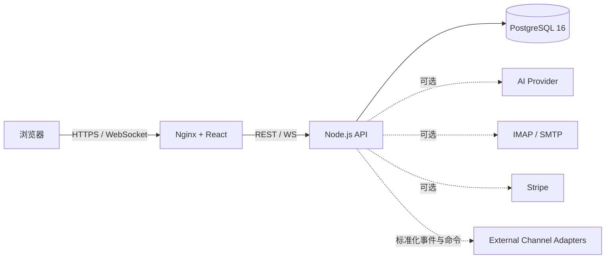

今天在 GitHub Trending 上看到一个有意思的项目：**灵犀跨境（lingxi）**——一套把跨境团队日常所需的客户沟通、翻译、AI 分析与经营看板打包进同一个开源产品里的多租户 SaaS。

## 一、项目概述

灵犀跨境（lingxi）定位于「跨境团队的多租户客户经营 SaaS」，它不是单一的客服工具，而是把一连串跨境业务经常割裂的能力整合到同一个产品里：

- **多租户账号体系**：企业注册、登录、团队、角色权限、Token 撤销与审计日志，租户资源在服务端强制校验归属。
- **统一消息中心**：会话分页、已读、引用、媒体元数据和 WebSocket 增量更新，把分散的沟通渠道归一。
- **AI 能力**：上下文感知翻译、逐句意图/情绪/风险识别、摘要，以及经人工确认的回复建议。
- **客户经营**：独立会话记忆、上下文压缩、客户画像与雷达图，联动标签、商机、跟进任务、知识库与经营分析。
- **外部集成**：企业邮箱 IMAP/SMTP、可选 Stripe 结算，以及 Telegram/WhatsApp 外部适配器契约（网关由部署者自行提供）。

核心设计哲学在 README 里写得非常清晰：PostgreSQL 是业务事实来源；WebSocket 只负责实时加速；AI 失败不阻断原始业务；所有租户资源必须在服务端校验归属。这意味着即使 AI、邮箱、支付都没有配置，登录、客户、知识、商机、任务和管理能力依然可以独立运行——这对自检、演示和灰度上线都很友好。

## 二、技术原理

### 架构设计

项目采用典型的前后端分离 + 边缘代理分层：



几个关键约束值得注意：

1. **PostgreSQL 作为 Single Source of Truth**：所有业务状态以数据库为准，WebSocket 推送只是「加速层」，断线重连后从 REST 拉取即可恢复，避免了实时通道与持久化状态不一致的经典坑。
2. **AI 失败可降级**：AI Provider 是可选依赖，调用失败不应打断原始消息流，保证核心沟通不依赖第三方。
3. **租户隔离在服务端强制校验**：所有资源访问必须带上租户归属校验，这是多租户 SaaS 的安全底线。

### 技术栈与选型

从 `package.json` 与 `Dockerfile` 可以看出工程化相当成熟：

- **前端**：React 18 + Vite 5 + TypeScript 5 + Tailwind CSS 3 + Zustand（状态）+ TanStack Query（服务端状态）+ React Hook Form + Zod（校验）+ Recharts（图表）+ react-router-dom 7。
- **后端**：Node.js（API 服务，代码在 `server/src`），承载认证、租户业务、消息、AI、邮箱、知识库、Webhook 与 WebSocket。
- **数据层**：PostgreSQL 16。
- **构建产物**：`Dockerfile` 使用多阶段构建，先在 `node:20-alpine` 跑 `npm run build`，再把 `dist` 拷贝进 `nginx:1.27-alpine`，并内置 `/health` 健康检查。

```dockerfile
FROM node:20-alpine AS web-build
WORKDIR /app
COPY package*.json ./
RUN npm ci
COPY . .
RUN npm run build

FROM nginx:1.27-alpine
COPY docker/nginx.conf /etc/nginx/conf.d/default.conf
COPY --from=web-build /app/dist /usr/share/nginx/html
EXPOSE 80
HEALTHCHECK --interval=15s --timeout=3s --retries=5 CMD wget -qO- http://127.0.0.1/health || exit 1
```

### 质量保障

仓库对测试有相当刻意的设计。`playwright.config.ts` 中**刻意把 `workers` 设为 1、关闭 `fullyParallel`**，原因是 E2E 用例共享同一真实租户与网关，串行化变更以避免桌面端与移动端用例在会话顺序、渠道状态上产生竞态：

```ts
fullyParallel: false,
workers: 1,
retries: 0,
projects: [
  { name: 'desktop-chromium', use: { ...devices['Desktop Chrome'] } },
  { name: 'mobile-chromium', use: { ...devices['Pixel 7'] } },
],
```

同时 `server/test/` 覆盖业务、可靠性、邮箱协议与身份归并测试，质量门禁命令齐全：`npm run typecheck`、`npm run build`、`npm test --prefix server`、`npm run test:e2e`。

## 三、安装与快速开始

### 环境要求

- Docker Engine 24+
- Docker Compose v2

### 最简启动

```bash
git clone git@github.com:wumingqi60/lingxi.git
cd lingxi
cp .env.example .env
```

编辑 `.env`，至少替换两个高敏感字段：

```env
LX_DB_PASSWORD=<独立随机密码>
LX_JWT_SECRET=<至少 32 字节随机值>
```

启动并自检：

```bash
docker compose --env-file .env up -d --build
docker compose ps
curl -fsS http://127.0.0.1:8088/health
```

打开 `http://127.0.0.1:8088` 注册第一个企业和管理员账号。未配置 AI、邮箱、支付和消息适配器时，对应功能会显示「未配置」，但登录、客户、知识、商机、任务和管理能力仍可正常运行。

### 本地开发

```bash
npm ci
npm run dev

cd server
npm ci
DATABASE_URL=postgresql://... JWT_SECRET=... npm start
```

## 四、使用方法与实战

### 基础用法

注册企业后，核心工作流是：在统一消息中心接入客户会话（Telegram/WhatsApp 通过外部适配器契约接入），系统在会话中自动提供上下文感知翻译、意图与情绪识别，并生成可人工确认的回复建议。你可以把高频问答沉淀进知识库，用标签与商机把对话转成可跟进的销售线索。

### 进阶用法

- **客户画像与雷达图**：系统基于会话记忆与上下文压缩生成客户画像，配合经营分析看板评估团队效能。
- **外部适配器契约**：`docs/CHANNEL_ADAPTERS.md` 定义了标准化的事件与命令接口，部署者可以自行接入消息平台网关，而不必被平台锁定。
- **企业邮箱与支付**：通过 IMAP/SMTP 接入企业邮箱，可选 Stripe 结算接口打通交易闭环。

### 实际项目示例

跨境电商卖家可以用灵犀跨境把分散在 Telegram、WhatsApp、企业邮箱的询盘统一到一个工作台，用多语言翻译消除沟通壁垒，用意图/情绪分析优先处理高价值或高风险客户，再用商机与任务把对话转化为可追踪的成交流程——而这一切都可以基于开源版本自托管，数据留在自己的 PostgreSQL 里。

## 五、常见问题与解决方案

**Q：docker compose 启动后 /health 返回异常？**
检查 `.env` 中的 `LX_DB_PASSWORD` 与 `LX_JWT_SECRET` 是否已替换为有效随机值；确认 `docker compose ps` 中数据库容器处于 healthy 状态后再访问。

**Q：AI / 邮箱 / 支付功能显示「未配置」？**
这些是可选依赖。未配置时核心业务（登录、客户、知识、商机、任务、管理）仍可运行；按 `docs/CONFIGURATION.md` 填入对应 Provider 凭据即可启用。

**Q：多租户隔离如何保证？**
所有租户资源访问必须在服务端做归属校验，且所有涉及租户隔离、认证、消息发送、支付或数据库结构的变更都要求补充测试与安全说明（见 CONTRIBUTING.md）。

**Q：E2E 测试偶发失败？**
仓库已刻意关闭并行（`workers: 1`）以避免共享租户下的竞态；如仍不稳定，可结合 `trace: 'retain-on-failure'` 在 `playwright-report` 中查看失败轨迹与截图。

## 六、总结

灵犀跨境（lingxi）是一个工程完成度很高的开源跨境客户经营 SaaS：它用清晰的分层架构（PostgreSQL 为事实来源、WebSocket 仅作加速、AI 可降级、租户隔离强制校验）把消息、翻译、AI 分析、客户画像与经营分析整合到一个可自托管的产品里。对于需要做多语言客户经营、又希望把数据和控制权留在自己手里的跨境团队，这是一个值得关注和试用的起点。

> 仓库地址：<https://github.com/wumingqi60/lingxi>，采用 Apache License 2.0（品牌商标需另见 NOTICE）。Telegram 与 WhatsApp 网关实现不在开源范围内，仅保留外部适配接口。
