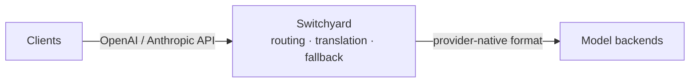

今天在 GitHub Trending 上看到一个很有意思的项目：**NVIDIA-NeMo/Switchyard**。它用 Rust 实现了一个 LLM 流量代理与路由库，让你的 Claude Code、Codex 这类编码智能体，能够在不改一行业务代码的前提下，把请求转发到 vLLM、NVIDIA NIM、Ollama 或任意 OpenAI 兼容端点。

## 一、项目概述

Switchyard 定位为一款 **面向 LLM 流量的 Rust 代理与库**。它的核心使命只有一句话：让客户端继续保持自己原生的 API 形态（OpenAI Chat / Anthropic Messages / OpenAI Responses），而由 Switchyard 在背后完成跨提供商的路由、协议翻译、指标采集与可组合的路由算法编排。

对于一个重度使用编码智能体的团队来说，这个价值非常直接：

- 你想把 Claude Code 指向一个开源模型？Switchyard 会自动在 OpenAI Chat、Anthropic Messages、OpenAI Responses 三种格式之间互转，智能体「以为」自己还在说原生 API，实际请求却由 vLLM / NIM / Ollama 提供服务。
- 你想做 A/B 评测、按信号做分级路由、或者跑一套自己写的算法？同一个代理层都能覆盖。

### 核心特性

- **协议翻译（Protocol Translation）**：在 OpenAI Chat、Anthropic Messages、OpenAI Responses 三种格式间双向转换。
- **多后端路由（Multi-Backend Routing）**：随机路由、LLM-as-classifier 路由、信号驱动的阶段路由（stage-router），或完全自定义的算法。
- **可观测指标（Operational Metrics）**：内置 Prometheus 指标，覆盖请求数、错误数、延迟、Token 消耗与路由开销（routing overhead）。

> ⚠️ 项目处于 pre-alpha 阶段，API 与算法在 v1.0 之前会有较大变化，官方明确标注「实验性软件，不建议生产使用」。

## 二、技术原理

### 架构总览

Switchyard 的架构遵循一个清晰的「翻译 + 路由」模型：客户端以原生 OpenAI 或 Anthropic API 格式访问 Switchyard，服务端接收三种格式（OpenAI Chat Completions、OpenAI Responses、Anthropic Messages），由配置的 LLM client 选定上游格式后转发，再把响应翻译回客户端期望的形态。



### 工程组织：Rust Workspace + Python 绑定

从仓库的 `Cargo.toml` 可以看到，Switchyard 是一个典型的 Cargo workspace，按职责拆分成多个 crate，并通过 `maturin` 暴露 Python 包 `nemo-switchyard`：

```toml
[workspace]
resolver = "3"
members = [
    "crates/libsy",
    "crates/libsy-llm-client",
    "crates/switchyard-py",
    "crates/protocol",
    "crates/switchyard-server",
    "crates/switchyard-skill-distillation",
    "crates/switchyard-translation",
]

[workspace.package]
version = "0.2.0"
edition = "2024"
license = "Apache-2.0"
```

各 crate 职责清晰：

- `switchyard-protocol`：提供 provider 中立的请求、响应与流式类型（provider-neutral types）。
- `switchyard-translation`：负责请求、响应与流的翻译。
- `switchyard-libsy`：把路由算法嵌入到你的 Rust 应用里（库路径）。
- `switchyard-server`：独立运行的 Rust 代理二进制。
- `switchyard-py`：通过 maturin 编译出 Python 可调用层，提供 `switchyard` CLI 与 `switchyard_rust` 底层模块。

值得注意的是 `pyproject.toml` 的一个工程取舍——开发工具（pytest / ruff / mypy 等）被放进了 PEP 735 的 `[dependency-groups].dev`，而不是 `optional-dependencies`，这样它们**不会**出现在发布 wheel 的 METADATA 中，从而避免下游漏洞扫描误报。这种「减少供应链噪声」的细节很 NVIDIA。

### 路由算法：可组合、类型化

Switchyard 把路由抽象成一组可组合的「route」，每个 route 注册一个或多个 target（后端），并由一种 `type` 决定路由策略：

| 策略 | 适用场景 | route `type` |
|---|---|---|
| LLM Classifier | 由请求内容判断该轮是否需弱/强档模型 | `llm_classifier` |
| Stage Router | 对话中已有的信号（工具结果、错误）即可决定路由，避免额外模型调用 | `stage_router` |
| Escalation Router | 每轮先跑弱档，再由裁判模型决定是否升级到强档 | `llm_classifier`（`mode = "escalation"`） |
| Random | 固定流量切分，用于 A/B、基线或成本核算 | `random` |

此外 `passthrough` 类型的 route 只注册一个 target 与一个 model ID，不做任何路由决策，适合最简单的透传场景。

`switchyard-libsy` 的设计尤其巧妙：它**从不自己调用模型**。算法只负责「选哪个 target」，然后把每一次模型调用交还给调用方。这意味着它可以无缝嵌入你已有的代理、网关或智能体运行时，而无需接管整套 HTTP 栈；当你确实希望由它代发请求时，再配合 `switchyard-llm-client` 即可。

## 三、安装与快速开始

Switchyard 提供三条使用路径：**Launcher（启动器）**、**Server（独立代理）**、**Library（库嵌入）**。

### 环境要求

- **Launcher / Python 包**：需安装 `uv`（用于分发 Python CLI）
- **Server 路径**：需安装 Rust 工具链（Cargo）
- **Library 路径**：Rust 1.96.1+，在你的 Rust 应用中以 git 依赖引入

### Launcher 路径：代理 Claude Code / Codex / OpenClaw

```bash
# 安装 uv（如尚未安装）
curl -LsSf https://astral.sh/uv/install.sh | sh
source "$HOME/.local/bin/env"

# 安装 Switchyard CLI（要求 Python 3.12）
uv tool install --python 3.12 "nemo-switchyard[cli]"
```

设置 OpenRouter Key，然后直接通过 Switchyard 启动你的编码智能体：

```bash
export OPENROUTER_API_KEY="your-openrouter-key"  # pragma: allowlist secret
switchyard launch claude --model switchyard
switchyard launch codex   --model switchyard
switchyard launch openclaw --model switchyard
```

若要使用自己的 TOML 部署，只需传入 route ID 与配置文件：

```bash
switchyard launch claude --model my-route --config routes.toml
```

### Server 路径：独立 Rust 代理

```bash
# 安装 Rust 后，从 crates.io 安装独立二进制
cargo install --locked switchyard-server
switchyard-server --help
```

创建 `routes.toml` 后，先用 `--dry-run` 校验配置，再启动服务：

```bash
export OPENROUTER_API_KEY="your-openrouter-key"  # pragma: allowlist secret
switchyard-server --config routes.toml --dry-run
switchyard-server --config routes.toml --host 127.0.0.1 --port 4000
```

在另一个终端验证代理健康状态：

```bash
curl http://localhost:4000/health
```

### Library 路径：在 Rust 应用中嵌入路由

```toml
[dependencies]
switchyard-libsy = { git = "https://github.com/NVIDIA-NeMo/Switchyard.git" }
switchyard-protocol = { git = "https://github.com/NVIDIA-NeMo/Switchyard.git" }
```

## 四、使用方法与实战

### 基础用法：统一协议接入

假设你的编码智能体原生使用 Anthropic Messages API，而你想用本地 vLLM（OpenAI 兼容）提供服务。传统做法需要改动智能体代码或维护两套适配层；而 Switchyard 让智能体照常调用 Anthropic 接口，由代理层在内部完成：

```
客户端 (Anthropic Messages) → Switchyard → (OpenAI Chat) vLLM / NIM / Ollama
```

智能体「无感」，部署「灵活」。

### 进阶用法：分级与评测路由

- **A/B 与成本核算**：用 `random` 策略做固定流量切分，对比不同模型的表现与开销。
- **强弱分级**：用 `llm_classifier` 让请求内容决定该轮是否走弱档或强档模型，显著降低成本。
- **信号驱动阶段路由**：用 `stage_router` 让对话里已有的工具结果、错误等信号直接决定路由，省去一次额外模型调用。
- **升级式路由**：每轮先在弱档跑，由裁判模型读取弱档答案，再决定是否把同一请求发给强档（`escalation` 模式）。

### 可观测：Prometheus 指标

Switchyard 自带 Prometheus 指标，覆盖请求、错误、延迟、Token 与路由开销。在代理运行后，即可在 Prometheus / Grafana 中观测各后端的真实负载与成本分布——这对多后端编排尤为重要。

## 五、常见问题与解决方案

**Q1：安装 `nemo-switchyard[cli]` 失败？**
确保使用 Python 3.12+，并通过 `uv tool install --python 3.12` 显式指定解释器版本。

**Q2：`switchyard-server` 启动报配置错误？**
先执行 `switchyard-server --config routes.toml --dry-run` 校验 `routes.toml` 的格式与路由定义，确认无误后再去掉 `--dry-run` 启动。

**Q3：智能体仍访问的是原模型，而非我配置的后端？**
检查 Launcher 启动时传入的 `--model` 对应的 route 是否在 `routes.toml` 中正确注册了 target；`passthrough` 类型需保证 model ID 与 target 一一对应。

**Q4：想把它嵌入现有网关，但不想接手 HTTP 栈？**
使用 `switchyard-libsy`，它只做路由决策并把调用交还给你；需要代发请求时再叠加 `switchyard-llm-client`。

**Q5：API 经常变动怎么办？**
项目处于 pre-alpha，算法与 API 在 v1.0 前会显著变化，建议锁定 git 提交或等待稳定版本再用于关键链路。

## 六、总结

Switchyard 抓住了当下 LLM 工程化中的一个真实痛点：**协议碎片化 + 多后端编排**。用 Rust 实现的代理 + 库双形态，既保证了代理路径的高性能与低开销，又通过 `libsy` 让路由能力可被任意 Rust 应用「即插即用」。协议翻译、可组合路由算法与开箱即用的 Prometheus 指标，三者叠加，使它成为构建「智能体 → 任意模型后端」中间层的强力候选。

不过需要提醒的是，它目前仍是实验性 pre-alpha 软件，API 尚未稳定，生产环境请谨慎评估。如果你正在做编码智能体的私有化部署、模型 A/B 评测或成本分级，Switchyard 非常值得在实验环境里跑一跑。

- 仓库地址：<https://github.com/NVIDIA-NeMo/Switchyard>
- 许可证：Apache 2.0（Copyright NVIDIA Corporation）
