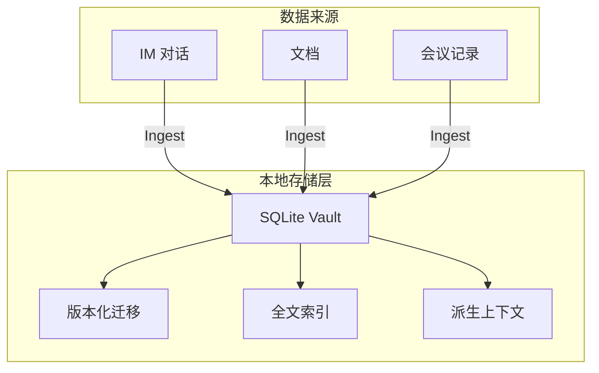

今天在 GitHub Trending 上看到一个有意思的项目：**MyContext**，它提出了一个很直接的问题——为什么每个 AI 对话都要从零开始？为什么不能把一个人的工作上下文（项目进展、沟通记录、决策历史）积累成一个可持续使用的记忆层，让大模型真正"认识"你？

## 一、项目概述

MyContext 是一个**本地优先的个人工作上下文记忆系统**，由 openTrinity 团队开发，当前处于开发者预览阶段。它将 IM、文档、日历、会议、审批等散落的工作信号，通过统一的数据模型汇聚为私有的个人知识图谱，供大模型、Agent 和授权的外部 AI 应用检索使用。

**核心定位：AI 是消费者，数据主权归用户。** 所有上下文数据保存在本地 SQLite vault 中，AI 通过受控接口访问，用户始终掌控操作权限（发送、删除等不可逆操作强制二次确认）。

技术栈选型也很有特色：
- **Electron + React** 构建桌面客户端
- **TypeScript monorepo**（pnpm workspace，15+ 个子包）
- **better-sqlite3** 作为本地数据库
- **i18next** 多语言支持
- Node ≥22.17（要求较新，说明项目面向未来）

## 二、技术架构

MyContext 的架构设计非常清晰，整个仓库按职责分为**九个独立层次**，层与层之间通过严格的 ESLint 依赖规则（layering rules）强制禁止反向依赖，确保依赖树始终是一棵有向无环图：

```
L0 树根层：kernel          — 不依赖任何 @mycontext 包
L1 契约层：ipc-contract / i18n  — 只依赖 kernel
L2 能力层：store / runtime-env / design / module-contract — 只依赖 L0+L1
L3 业务层：ingest / retrieval / agent-runtime / distill / persona / knowledge-feed / channels — 依赖 L0+L1+L2
```

### 分层依赖管控

项目用 ESLint 的 `no-restricted-imports` 规则硬编码了分层约束，以下是核心实现（来自 `eslint.config.mjs`）：

```typescript
// L3 业务包不得依赖其他 L3 包，防止业务层相互耦合
const L3_PACKAGES = [
  "ingest", "retrieval", "agent-runtime",
  "distill", "persona", "knowledge-feed", "channels",
]

{
  files: ["packages/store/**/*.ts", "packages/runtime-env/**/*.ts", ...],
  rules: {
    "no-restricted-imports": ["error", {
      patterns: [{
        group: L3_PACKAGES.map(name => `@mycontext/${name}`),
        message: "L2 不得依赖 L3 业务包",
      }],
      paths: [{ name: "electron", message: "packages/* 不得依赖 electron" }],
    }],
  },
}
```

这条规则用两条红线保证架构健康：①禁止 L2 依赖 L3（能力层不能依赖业务层）；②禁止任何包依赖 Electron（保证所有领域包可在 Node.js 环境中直接测试运行）。

### 时间感知设计

业务逻辑中的 TTL、频率上限、LRU 回收等时间敏感行为，全部**禁用裸 `Date.now()`**，改为注入 `@mycontext/kernel` 的 `Clock` 接口：

```typescript
// 禁用裸 Date.now()
{
  selector: "CallExpression[callee.object.name='Date'][callee.property.name='now']",
  message: "禁用裸 Date.now()：注入 @mycontext/kernel 的 Clock",
}
```

这使得心跳超时、授权过期等逻辑可以用**虚拟时钟（fake timers）** 精确测试，7 天心跳超期这种场景不再需要真实等待。

### 包管理拓扑

根 `package.json` 中的 `pnpm workspaces` 配置了完整的 TypeScript project references 拓扑：

```json
{
  "references": [
    { "path": "packages/kernel" },
    { "path": "packages/store" },
    { "path": "packages/ingest" },
    { "path": "packages/persona" },
    { "path": "packages/retrieval" },
    { "path": "apps/desktop" },
    ...
  ]
}
```

`vitest.config.ts` 通过 `createRequire` 动态解析子包路径（如 `@dicebear/core` 只安装在 `packages/design` 下），解决了 monorepo 中测试文件跨包 import 的路径解析问题。

## 三、数据源与采集链路

MyContext 当前已打通三类数据源的采集链路：

| 数据源 | 实现包 | 说明 |
|--------|--------|------|
| 即时通讯 | `channels` | 接入 IM 平台的授权数据读取 |
| 文档 | `channels` | 文档内容与元数据的同步 |
| 会议记录 | `channels` | 会议内容提取与结构化 |

采集层（`ingest`）设计了几个关键机制：
- **增量同步**：记录 checkpoint，避免每次全量重读
- **检查点与重试**：网络异常时自动断点续传
- **规范化**：不同数据源统一为同构模型

待扩展方向包括日历、邮件、审批流等——项目刻意采用了**统一数据源抽象**，扩展新数据源不需要改动消费侧代码。

## 四、核心能力：记忆图谱与数字分身

### 记忆图谱（Personal Context Graph）

将人、项目、话题、事件、会话等信息组织为以"我"为中心的知识图谱。用户可以从个人视角探索关系连接，回溯到原始证据（而不是只看摘要），实现真正的上下文复用。

### 数字分身（Digital Self）

数字分身基于个人上下文、沟通习惯和关系历史，辅助处理日常工作对话。它能理解新消息、召回相关背景，并准备符合用户风格的回复——但**发送操作始终需要用户明确授权**，这一点在架构中被硬编码为"操作安全闸"。

### 搜索问答

结合本地全文检索、语义召回和图谱查询，用自然语言询问工作历史。系统可追溯到具体来源证据；当 Agent 运行时不可用时，会明确降级为本地检索结果，而**不会悄悄生成无依据的答案**——这个降级策略是架构层面的设计选择。

## 五、本地存储设计

所有个人数据保存在本地 SQLite 数据库中：



迁移采用版本化管理（`migrations/`），迁移脚本可能要求重新执行数据采集，且部分改动不可逆——项目在文档中明确警告用户**不要将此构建版本作为唯一数据存放处**，体现了诚实的产品态度。

## 六、快速上手

```bash
# 环境要求
node >=22.17.0, <23
pnpm >=10.13.0

# 克隆并安装依赖
git clone https://github.com/openTrinity/mycontext
cd mycontext
pnpm install

# 开发模式（需先构建 native 依赖）
pnpm run dev

# 构建桌面应用
pnpm run dist:mac

# 运行测试
pnpm run test
```

项目提供了 `verify` 脚本，执行完整的质量门禁检查（格式 + lint + 类型 + 所有 check 脚本 + 单元测试 + 冒烟测试），一条命令覆盖全链路质量保障。

## 七、总结

MyContext 解决的是一个正在爆发的问题：**AI 工具越来越多，但每个工具对用户的"认知"都是空的**。MyContext 的思路很务实——不做另一个 AI 产品，而是做一个**个人数据中间层**，让现有的 AI 工具真正为个人所用。

架构层面的亮点在于用 ESLint 规则**硬编码了分层架构约束**，配合 Clock 注入式时间测试和 monorepo 的严格 project references，从工程实践上保证了代码库的可维护性。当前处于开发者预览阶段（会有破坏性更新），适合有技术背景的用户参与贡献。

**许可：** Elastic License 2.0（源码可用，可自托管和企业内使用，但不得作为托管服务对外提供）
