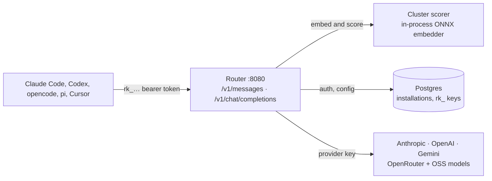

今天在 GitHub Trending 上发现了一个非常实用的项目：**Weave Router**，它是一个智能的 AI 模型路由代理，能根据每次请求的语义内容自动选择最合适的模型，实现成本与性能的最优平衡。

## 一、项目概述

Weave Router 是一个 **drop-in proxy**（即插即用代理），介于你的应用和各大 AI 提供商之间。它最大的特点是：**对每个请求都进行语义分析，然后智能路由到最优模型**。

### 核心特性

- **🎯 请求级智能路由**：基于 Avengers-Pro 论文实现的集群评分器，通过本地 ONNX 嵌入模型分析请求内容，动态选择最合适的模型
- **🔌 多 API 协议支持**：原生支持 Anthropic Messages、OpenAI Chat Completions、Gemini native API，支持流式响应、工具调用、视觉输入等完整功能
- **🧠 支持开源模型**：通过 OpenRouter 或任何 OpenAI 兼容端点，可以使用 DeepSeek、Kimi、GLM、Qwen、Llama、Mistral 等开源模型
- **🔒 BYOK 默认安全**：提供商密钥留在本地，静态加密，无需上传到第三方
- **📊 内置可观测性**：开箱即用的 OTLP 追踪，支持 Honeycomb、Datadog、Grafana 等监控平台

## 二、技术原理

### 架构设计

Weave Router 采用 **本地化 + 语义路由** 的架构设计：



核心流程：
1. **请求接收**：Router 接收标准 API 请求（Anthropic/OpenAI/Gemini 格式）
2. **语义嵌入**：使用本地 ONNX 嵌入模型（Jina v2-base-code）将请求转换为向量
3. **集群评分**：基于 Avengers-Pro 算法计算各模型对该请求的适配度
4. **智能路由**：选择最优模型并转发请求
5. **响应返回**：流式返回提供商的响应

### 核心技术栈

从源码可以看出技术选型的精巧：

**1. 语义嵌入（Jina v2 + ONNX Runtime）**

```dockerfile
# Dockerfile 中嵌入了 Jina v2-base-code 模型
ARG HF_MODEL_REPO=jinaai/jina-embeddings-v2-base-code
ARG HF_MODEL_REVISION=516f4baf13dec4ddddda8631e019b5737c8bc250
```

使用 **ONNX Runtime** 在本地运行嵌入模型，无需依赖外部服务：

```bash
# CGO 编译启用 ONNX Runtime
CGO_ENABLED=1 \
CGO_CFLAGS="-I/opt/onnxruntime/include" \
CGO_LDFLAGS="-L/opt/onnxruntime/lib -L/opt/libtokenizers -lonnxruntime"
```

**2. 集群评分器（Avengers-Pro 算法）**

基于论文 *Beyond GPT-5: Making LLMs Cheaper and Better via Performance–Efficiency Optimized Routing* 实现的路由策略：

- 使用 **隐马尔可夫模型（HMM）** 分析请求特征
- 考虑模型的 **性能-效率比**（非简单的成本排序）
- 支持动态调整策略（通过环境变量 `ROUTER_DEFAULT_STRATEGY=hmm`）

**3. 多协议适配层**

Router 提供了统一的路由接口，底层适配各提供商：

```go
// 支持的端点（from Dockerfile docs）
POST /v1/messages              // Anthropic Messages API
POST /v1/chat/completions      // OpenAI Chat Completions
POST /v1beta/models/:action    // Gemini generateContent
POST /v1/route                 // 仅返回路由决策（调试用）
```

### 关键设计模式

**1. 策略模式（路由策略）**

支持多种路由策略：
- **cluster**：基于嵌入向量的集群评分（默认）
- **hmm**：基于 HMM 的策略侧车（可选）
- **heuristic**：启发式回退策略

```bash
# 启用 HMM 策略
make up-hmm
```

**2. 密钥管理（BYOK 加密）**

使用 Google Tink 加密库管理提供商密钥：

```go
// go.mod 中引入 Tink 加密库
github.com/tink-crypto/tink-go/v2 v2.2.0
```

密钥加密后存储在 Postgres，Router 启动时解密使用，确保 **密钥不出本地**。

**3. 可观测性（OTLP）**

内置 OpenTelemetry 支持，一键接入监控：

```go
// go.mod 中的 OTel 依赖
go.opentelemetry.io/otel v1.43.0
go.opentelemetry.io/otel/exporters/otlp/otlptrace/otlptracegrpc v1.43.0
```

## 三、安装与快速开始

### 环境要求

- **Docker**（推荐）或 Go 1.25+
- PostgreSQL（Docker Compose 自动启动）
- 至少一个提供商 API Key（推荐 OpenRouter 作为基准）

### 最快上手：使用托管服务

```bash
# 一键安装（自动配置 Claude Code / Codex / opencode / pi）
npx @workweave/router
```

安装器会：
1. 选择客户端工具（Claude Code、Codex、opencode、pi）
2. 配置作用域（用户级或项目级）
3. 获取 Router Key（`rk_...`）
4. 自动修改配置文件

### 自托管完整栈

如果你想完全掌控路由器和仪表盘：

```bash
# 1. 配置提供商密钥
echo "OPENROUTER_API_KEY=sk-or-v1-..." >> .env.local

# 2. 启动 Postgres + Router（会自动生成 rk_ key）
make full-setup
```

Router 启动在 `http://localhost:8080`，仪表盘在 `http://localhost:8080/ui/`（默认密码 `admin`）。

### 验证安装

```bash
# 测试 Anthropic API 格式
curl -sS http://localhost:8080/v1/messages \
  -H "Authorization: Bearer rk_..." \
  -d '{"model":"claude-sonnet-4-5","max_tokens":256,"messages":[{"role":"user","content":"hi"}]}'

# 测试 OpenAI API 格式
curl -sS http://localhost:8080/v1/chat/completions \
  -H "Authorization: Bearer rk_..." \
  -d '{"model":"gpt-4o-mini","messages":[{"role":"user","content":"hi"}]}'

# 仅查看路由决策（不转发请求）
curl -sS http://localhost:8080/v1/route \
  -H "Authorization: Bearer rk_..." \
  -d '...'
```

## 四、使用方法与实战

### 基础用法

**1. Claude Code 集成**

```bash
# 自动配置 Claude Code 使用 Router
make install-cc

# 或使用托管服务
npx @workweave/router --claude
```

配置后，Claude Code 所有请求都会经过 Router 的智能路由。

**2. Codex（OpenAI CLI）集成**

```bash
npx @workweave/router --codex
```

安装器会修改 `~/.codex/config.toml`，添加 Weave 提供商配置：

```toml
[model_providers.weave]
# ... Router 配置

[model_provider]
name = "weave"  # 默认使用 Router
```

**3. Cursor 集成**

手动配置：
1. Settings → Models → *Override OpenAI Base URL*
2. 填入 `http://localhost:8080/v1`
3. 粘贴 `rk_...` 作为 API Key

### 进阶用法

**1. 查看和管理可用模型**

```bash
# 列出所有模型及其状态
npx @workweave/router models --claude

# 启用/禁用特定模型
npx @workweave/router models enable gpt-4o
npx @workweave/router models disable claude-opus-4
```

**2. 强制选择特定模型**

Router 支持运行时强制指定模型：

```bash
# 在 Claude Code 中使用斜杠命令
/router-models gpt-5.6-terra  # 强制使用特定模型
/router-off                    # 暂时关闭路由
/router-on                     # 重新启用路由
```

**3. 切换路由开关**

```bash
# 关闭路由（直连提供商）
npx @workweave/router off --claude

# 重新启用路由
npx @workweave/router on --claude

# 查看状态
npx @workweave/router status --claude
```

### 实际项目示例

假设你在开发一个多模态应用，不同任务需要不同模型：

```python
import openai

# 所有请求统一发送到 Router
client = openai.OpenAI(
    base_url="http://localhost:8080/v1",
    api_key="rk_..."
)

# 简单查询 → Router 自动选择便宜模型
response = client.chat.completions.create(
    model="auto",  # Router 会自动选择
    messages=[{"role": "user", "content": "What is 2+2?"}]
)

# 复杂推理 → Router 自动选择强模型
response = client.chat.completions.create(
    model="auto",
    messages=[{"role": "user", "content": "Analyze this complex system architecture..."}]
)
```

Router 会根据请求的语义复杂度自动选择模型，你无需手动判断。

## 五、常见问题与解决方案

### 安装失败

**问题 1：Docker 启动失败**

```bash
# 检查端口占用
lsof -i :8080
lsof -i :5433

# 清理旧容器
docker compose down
docker compose up --build -d
```

**问题 2：ONNX Runtime 加载失败**

从源码可知，Router 使用 CGO 加载 ONNX Runtime：

```bash
# macOS 需要安装 ONNX Runtime
brew install onnxruntime

# 设置环境变量（from .env.local）
export ROUTER_ONNX_LIBRARY_DIR=/opt/homebrew/lib
```

### 运行时错误

**问题 1：路由器无法选择模型**

检查可用模型列表：

```bash
npx @workweave/router models --claude
```

确保至少启用了一个模型，且配置了对应的提供商密钥。

**问题 2：认证失败（401 Unauthorized）**

区分两种密钥：
- `sk-or-...` / `sk-ant-...`：提供商密钥（放在 `.env.local`）
- `rk_...`：Router 密钥（客户端发送的 Bearer token）

```bash
# 检查 Router Key 是否正确
grep -E "^rk_" ~/.claude/config.json

# 检查提供商密钥
grep -E "^OPENROUTER_API_KEY|^ANTHROPIC_API_KEY" .env.local
```

### 性能问题

**问题 1：首次请求延迟高**

Router 首次启动时需要加载嵌入模型（Jina v2 约 162MB）：

```bash
# 查看启动日志
docker compose logs -f server | grep -i embedder

# 预热模型（可选）
curl http://localhost:8080/v1/route \
  -H "Authorization: Bearer rk_..." \
  -d '{"model":"auto","messages":[{"role":"user","content":"warmup"}]}'
```

**问题 2：内存占用过高**

Router 默认在进程内运行嵌入模型：

```bash
# 查看内存使用
docker stats router-server

# 限制内存（docker-compose.yml）
services:
  server:
    deploy:
      resources:
        limits:
          memory: 2G
```

### 兼容性

**问题 1：不支持某些 API 功能**

Router 支持主流功能，但部分高级功能可能有限制：

- ✅ 流式响应
- ✅ 工具调用（Function Calling）
- ✅ 视觉输入（Vision）
- ⚠️ 批量请求（Batch API）需检查提供商支持

**问题 2：与其他工具冲突**

如果同时使用多个 AI 客户端工具：

```bash
# 分别配置各自的配置文件
npx @workweave/router --claude    # ~/.claude/config.json
npx @workweave/router --codex     # ~/.codex/config.toml
npx @workweave/router --opencode  # ~/.config/opencode/opencode.json
```

## 六、总结

Weave Router 是一个 **实用主义** 的 AI 基础设施工具：

**✅ 优点：**
- **真正的智能路由**：基于语义的请求级路由，而非简单的轮询或随机
- **开箱即用**：支持主流 AI API 协议，无代码改造接入
- **成本可控**：本地运行嵌入模型，无额外云服务费用
- **安全合规**：BYOK + 本地加密，密钥不出本地
- **可观测性强**：内置 OTLP 支持，无缝接入现有监控体系

**⚠️ 注意事项：**
- 首次启动需下载嵌入模型（~200MB）
- 自托管需要维护 Postgres 实例
- 路由策略调优需要一定的监控和数据分析

**🎯 适用场景：**
- 多模型混合使用，希望优化成本
- 需要统一入口管理多个 AI 提供商
- 对成本和性能有较高要求的生产环境
- 需要审计和追踪 AI 使用情况的企业场景

如果你在寻找一个 **既能降低成本又不牺牲性能** 的 AI 路由解决方案，Weave Router 值得一试。它的本地化设计、语义级路由策略，以及开箱即用的多协议支持，使其成为当前最实用的 AI 模型路由器之一。

---

**项目地址**：https://github.com/workweave/router  
**文档**：[Configuration Reference](docs/CONFIGURATION.md) | [Architecture](AGENTS.md)  
**许可证**：ELv2（Elastic License 2.0）
