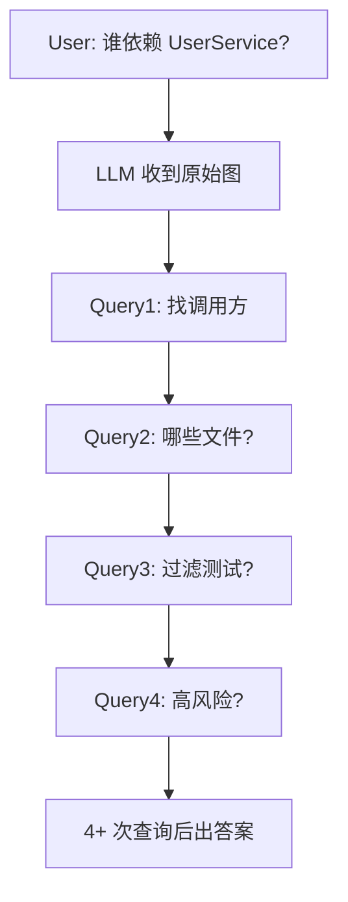

今天在 GitHub Trending 上看到一个有意思的项目：**GitNexus**（Akon Labs）。它自称是「AI Agent 的神经系统」——把任意代码库索引成一张知识图谱，再通过 MCP 工具让 AI 编程助手真正「懂」你的代码结构，而不是凭搜索结果盲改代码。

## 一、项目概述

GitNexus 解决的是一个非常具体的痛点：**现代 AI 编程 Agent（Cursor、Claude Code、Codex、Windsurf 等）并不真正理解你的代码库结构**。于是经常出现这样的事故链：

1. AI 改了 `UserService.validate()` 的返回类型；
2. 它不知道有 47 个函数依赖这个返回值；
3. 破坏性变更就这么悄悄上线了。

传统 Graph RAG 的做法是把原始图边丢给 LLM，指望它自己多轮探索——往往要 4 次以上查询才能拼出一个答案。GitNexus 的核心创新是 **Precomputed Relational Intelligence（预计算关系智能）**：在「索引期」就把聚类、调用链追踪、置信度评分等结构预先算好，Agent 一次调用就能拿到完整上下文。

项目以 CLI + MCP 的形式提供，同时配套一个浏览器内的 Web UI（基于 Vercel 部署，无需安装）。它有两种典型用法：

| | CLI + MCP（推荐） | Web UI |
| --- | --- | --- |
| 形态 | 本地索引仓库，通过 MCP 连接 Agent | 浏览器内图谱浏览器 + AI 对话 |
| 适合 | Cursor / Claude Code / Codex 日常开发 | 快速探索、Demo、一次性分析 |
| 存储 | LadybugDB 原生（快、持久） | LadybugDB WASM（内存内） |

此外还支持 `gitnexus serve` 的 Bridge 模式，让 Web UI 自动发现本地服务器，直接浏览所有已索引仓库，无需重新上传或重新索引。

## 二、技术原理

### 索引 → 图谱 → MCP 的三段式流水线

GitNexus 的处理流程可以概括为：**解析（Parse）→ 建图（Graph）→ 暴露（MCP）**。

- **解析层**：使用 Tree-sitter 原生绑定做 AST 解析（CLI 端），支持 TypeScript、JavaScript、Python、Java、Kotlin、Go 等二十多种语言，能够识别导入、具名绑定、导出、继承、类型注解、构造函数推断、配置、框架与入口点。
- **建图层**：将解析结果组织成知识图谱，节点是符号（函数、类、模块、路由、MCP 工具），边是调用关系、类成员关系、依赖关系与数据流。
- **智能层**：在索引期跑 Leiden 社区检测（功能聚类）、执行流（Process）检测、置信度评分，把「原始图」变成「预结构化上下文」。

### 混合检索：BM25 + 语义 + RRF

`query` 工具不是简单的关键字匹配，而是 **BM25 + 语义向量 + RRF（Reciprocal Rank Fusion）** 的融合排序：

```text
query("payment refund") 
  → BM25 召回候选
  → 语义向量召回候选
  → RRF 融合重排
  → 按 process（执行流）分组返回
```

语义向量由 HuggingFace `transformers.js`（底层 `onnxruntime-node`）在本地生成，无需联网；开启 `--embeddings` 后会把向量存入 LadybugDB 的向量索引。

### 为什么一次调用就够

传统 Graph RAG 让 LLM 自己探索图：



GitNexus 把它变成：

```text
impact("UserService" upstream)
  → 预结构化响应: 8 个调用方 / 3 个聚类 / 全部 90%+ 置信度
  → 1 次查询拿到完整答案
```

这带来三个收益：**可靠性**（LLM 不会漏掉上下文）、**Token 经济性**（无需 10 次链式查询）、**模型平权**（小模型也能用，因为重活由工具干了）。

### 真实代码片段一瞥

Web 服务端对配置做了相当严谨的边界处理，例如对数值型环境变量的解析会防御「`-1` 把超时悄悄关掉」这类陷阱：

```js
// Falls back to RENDER_EXTERNAL_URL so a Render web service hands the browser
// its own public origin — same-origin API calls via the proxy below, no config.
function numberFromEnv(label, fallback, min = 0) {
  const raw = process.env[label];
  if (raw === undefined || raw === '') return fallback;
  const n = Number(raw);
  if (!Number.isFinite(n)) {
    console.warn(`[gitnexus-web] ${label} "${raw}" is not a number -- using ${fallback}.`);
    return fallback;
  }
  if (n < min) {
    console.warn(`[gitnexus-web] ${label} "${raw}" is below the minimum ${min} -- using ${fallback}.`);
    return fallback;
  }
  return n;
}
```

### 完整技术栈

| 层 | CLI | Web |
| --- | --- | --- |
| Runtime | Node.js（原生） | 浏览器（WASM） |
| 解析 | Tree-sitter 原生绑定 | Tree-sitter WASM |
| 数据库 | LadybugDB 原生 | LadybugDB WASM |
| 嵌入向量 | HuggingFace transformers.js（GPU/CPU） | transformers.js（WebGPU/WASM） |
| 检索 | BM25 + 语义 + RRF | BM25 + 语义 + RRF |
| Agent 接口 | MCP（stdio） | LangChain ReAct Agent |
| 可视化 | — | Sigma.js + Graphology（WebGL） |
| 前端 | — | React 18 / TypeScript / Vite / Tailwind v4 |
| 聚类 | Graphology | Graphology |
| 并发 | Worker 线程 + async | Web Workers + Comlink |

LadybugDB（原 KuzuDB）是内嵌的带向量支持的图数据库；`--pdg` 索引还能构建语句级的控制/数据依赖图，支撑 `explain`（污点分析 source→sink）与 `pdg_query`。

## 三、安装与快速开始

GitNexus 以 npm 包分发，**核心两步即可跑起来**：

```bash
# 1. 在仓库根目录索引代码库
npx gitnexus analyze

# 2. 连接你的编辑器（一次性的，会自动探测 Claude Code / Cursor / Codex …）
npx gitnexus setup
```

`analyze` 会完成索引、安装 Agent skills、注册 Claude Code hooks，并生成 `AGENTS.md` / `CLAUDE.md` 上下文文件；`setup` 则写入 MCP 配置，让你的 AI Agent 能用上这张图。

### 环境要求

- Node.js ≥ 22.15（22.x）或 ≥ 23.5（23.x），用于按需加载嵌入运行时（older Node 需 `ONNXRUNTIME_NODE_INSTALL=skip`）。
- 建议全局安装以加速 MCP 启动：`npm i -g gitnexus`，再用 `gitnexus setup`（写入绝对路径的 MCP 配置，绕过 `npx` 的冷启动开销与 `MCP_TIMEOUT` 超时）。

### 一键部署（可选）

项目提供 Render Blueprint 一键部署：`gitnexus-server` 跑 `gitnexus serve`（私有网络、持久磁盘），`gitnexus-web` 作为公网服务反向代理 `/api/*`。默认配置约 $35/月。

## 四、使用方法与实战

### 17 个 MCP 工具（15 个仓库级 + 2 个组级）

连接后，Agent 能直接调用这些工具：

| 工具 | 作用 |
| --- | --- |
| `list_repos` | 发现所有已索引仓库（分页） |
| `query` | 按 process 分组的混合检索（BM25 + 语义 + RRF） |
| `context` | 360° 符号视图：分类引用、参与的 process |
| `impact` | 爆炸半径分析（按深度分组 + 置信度） |
| `trace` | 两个符号间最短有向路径（调用 + 类成员边） |
| `detect_changes` | Git diff 影响分析，把改动行映射到受影响 process |
| `check` | 对索引图做只读结构检查 |
| `rename` | 多文件协同重命名（图 + 文本搜索） |
| `cypher` | 原始 Cypher 图查询 |
| `route_map` | API 路由图：哪些组件请求哪些端点与 handler |
| `tool_map` | MCP/RPC 工具定义的位置与处理者 |
| `shape_check` | 校验 API 响应结构与消费方属性访问是否一致 |
| `api_impact` | 变更前的 API 路由 handler 影响报告 |
| `explain` | 解释持久化污点发现（source→sink 流，`--pdg` 索引） |
| `pdg_query` | 语句级控制/数据依赖查询（`--pdg` 索引） |
| `group_list` / `group_sync` | 列出 / 重建仓库组的契约注册与跨仓链接 |

另提供 11 个 `gitnexus://` 资源（如 `gitnexus://repos`、`gitnexus://repo/{name}/clusters`）和 2 个 MCP Prompt（`detect_impact` 提交前影响分析、`generate_map` 架构文档生成）。

### 实战示例 1：改接口前先算爆炸半径

在让 Agent 修改 `UserService.validate()` 之前，先问：

```text
impact("UserService.validate" upstream)
```

一次性拿到「8 个调用方 / 3 个聚类 / 全部 90%+ 置信度」，Agent 就知道这次改动会波及哪些模块，从而主动更新依赖方、补充测试。

### 实战示例 2：提交前影响分析

```text
detect_impact
```

它会基于当前 Git diff，把改动行映射到受影响的执行流（process），给出影响范围、风险等级——相当于给 PR 上了一道「图感知」的护栏。

### 实战示例 3：自动生成项目级 Agent Skills

```bash
# 检测代码库功能区域（Leiden 社区检测），为每个模块生成专属 skill
gitnexus analyze --skills
```

GitNexus 会把每个功能区域生成成 `.claude/skills/gitnexus-area-<name>/` 下的项目级 skill，描述该模块的关键文件、入口点、执行流与跨区连接，每次 `--skills` 都会重新生成以保持最新。若仓库含 `.agents/` 目录，还会同步镜像到 `.agents/skills/`（Codex 等可读取）。

## 五、常见问题与解决方案

**Q1：npm 11.x 安装时崩溃 `Cannot destructure property 'package'`？**
这是 npm/arborist 的已知 bug（GitNexus 跑起来之前就崩）。改用 pnpm 显式构建原生依赖：

```bash
pnpm --allow-build=@ladybugdb/core --allow-build=gitnexus --allow-build=tree-sitter dlx gitnexus@latest analyze
```

或先全局安装再运行：`npm install -g gitnexus@latest` 后 `gitnexus analyze`。

**Q2：安装时没有 C++ 工具链（python3 / make / g++）？**
设置 `GITNEXUS_SKIP_OPTIONAL_GRAMMARS=1` 跳过 Dart/Proto/Swift/Kotlin 四个内置语法的构建，几秒完成安装；其余语言照常解析。

**Q3：在 HTTP 代理 / 区域防火墙后，嵌入运行时下载失败？**
嵌入栈是可选依赖，下载失败不再中断安装，且会自愈：首次 `gitnexus analyze --embeddings` 会经你的 npm 镜像拉取，存入 `~/.gitnexus/embedding-runtime`。

**Q4：冷启动 MCP 超时（Claude Code 的 `MCP_TIMEOUT`）？**
全局安装后运行 `gitnexus setup`，会写入绝对路径的 MCP 配置，完全绕过 `npx` 的冷缓存开销。

**Q5：大型仓库索引时内存不足？**
（自托管 / Render）调高实例规格：`standard` 约 2 GB、`pro` 约 4 GB 内存。

## 六、总结

GitNexus 把「让 AI 理解代码库」这件事，从「靠 LLM 自己探索」变成了「在索引期就把结构算好、随用随取」。它不只是一个可视化图谱，而是一套 **Agent 原生的上下文基础设施**：17 个智能 MCP 工具 + 11 个资源 + 项目级 skills，让 Cursor、Claude Code、Codex 等不再盲改代码。

值得关注的几点：
- **本地优先、隐私友好**：CLI 全程本地运行、无网络调用，索引存于 gitignored 的 `.gitnexus/`；Web 端代码不出浏览器。
- **模型平权**：重活由工具承担，小模型也能获得完整架构视野。
- **多 Agent 生态友好**：对 Claude Code / Cursor / Codex / Antigravity 提供 MCP + skills + hooks 的完整集成。

如果你正在用 AI 写代码、又常被「改一处崩一片」困扰，GitNexus 值得一试——一条 `npx gitnexus analyze` 命令，就能给你的 Agent 装上「神经系统」。

> 项目地址：https://github.com/abhigyanpatwari/GitNexus （许可证：PolyForm Noncommercial，商用需关注其企业版授权）
