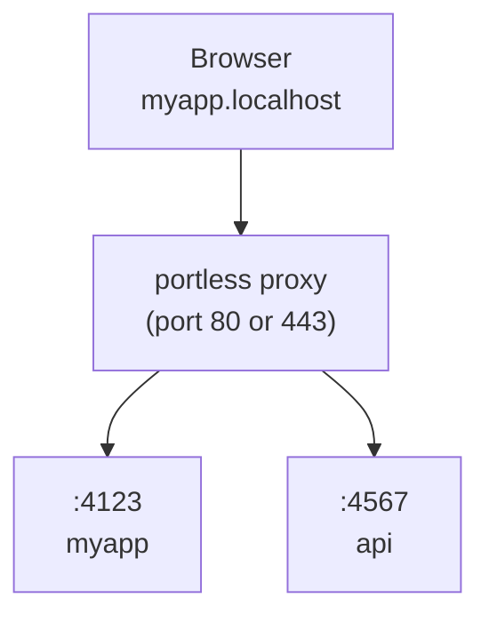

今天在 GitHub Trending 上看到一个有意思的项目：**vercel-labs/portless**，它想解决一个几乎所有前端开发者都踩过的坑——本地开发时那一串难以记忆、还会随机变化的端口号（`localhost:3000`、`localhost:5173`、`localhost:8787`……）。portless 把这些端口号换成稳定、可读、且默认带 HTTPS 的命名域名（`https://myapp.localhost`），人和 AI agent 都能一眼看懂。

## 一、项目概述

portless 是一个本地开发代理（local dev proxy），核心理念只有一句话：**用稳定的命名 `.localhost` URL 替换端口号**。

```diff
- "dev": "next dev"                  # http://localhost:3000
+ "dev": "portless run next dev"     # https://myapp.localhost
```

它解决的实际痛点包括：

- **端口冲突与失忆**：多个服务同时跑时端口号容易撞车，且每次重启可能变号，URL 难以分享给同事或写入文档。
- **HTTPS 缺席**：本地默认是 HTTP，导致 Cookie、`Secure` 属性、跨域、Service Worker 等行为与生产不一致。
- **OAuth / 跨域重定向难配**：严格的 OAuth 提供方（Google、Apple）拒绝 `.localhost` 和 `.test` 作为回调域名，生产用真实域名时本地无法对齐。
- **多服务协作混乱**：前端代理后端、monorepo 多包、Git worktree 并行开发时，URL 治理成本陡增。

portless 的关键特性：

- 默认开启 **HTTPS（HTTP/2）**，首次运行自动生成本地 CA 并写入系统信任库，浏览器无警告。
- 自动为框架分配随机端口（4000–4999）并通过 `PORT` 环境变量或 `--port` flag 注入（覆盖 Next.js、Express、Nuxt、Vite、Astro、Angular、Expo 等主流框架）。
- 内置 **monorepo 发现**、**子域名路由**、**Git worktree 自动隔离**、**LAN / Tailscale / ngrok 共享**。
- 代理随应用运行自动启停，配置在重启/重启系统后持久复用。

## 二、技术原理

### 2.1 整体架构

portless 由两部分协作：**proxy（常驻反向代理）** 与 **runner（应用启动器）**。



1. **启动代理**：运行应用时自动拉起，或显式 `portless proxy start`。
2. **运行应用**：`portless <name> <command>` 分配空闲端口并注册到代理。
3. **通过 URL 访问**：`https://<name>.localhost` 经代理转发到对应应用。

默认代理监听 443（HTTPS）/ 80（HTTP），且仅绑定回环地址 `127.0.0.1` 与 `::1`（非 LAN 模式），不会被局域网或 VPN 访问。

### 2.2 端口自动分配与框架感知

proxy 为子进程分配随机端口（范围 4000–4999），通过 `PORT` 环境变量下发。多数框架（Next.js、Express、Nuxt）会自动读取 `PORT`。对于忽略 `PORT` 的框架（Vite、Astro、React Router、Angular、Expo、React Native），portless 会**自动注入正确的 `--port` flag**（必要时再加 `--host`）。

其注入逻辑相当克制，只对"服务类"命令下手：

```text
脚本命令以框架或已知 runner 开头时注入：
  "dev": "vite"            → 注入 --port
  "dev": "bunx vite"       → 注入 --port
仅以下命令接收 flag：dev / serve / preview / start / 裸 vite / vite [root]
```

以下情况**主动放弃注入**，保留脚本原端口（README 明确列出）：

- 复合命令（`&&`、`|`、`;`）或尾随 `# 注释`；
- 自身的 `--` 选项终结符；
- 环境变量前缀（如 `NODE_ENV=production vite`）；
- 委托给另一个脚本（`"dev": "npm run dev:vite"`）；
- runner flag 在脚本名之前（`bun run --bun dev`）；
- 无法分类的 CLI（如 `vp --mode dev build`）。

> 要点：portless 不会"强行接管"它读不懂的命令，遇到 `vite build`、`astro check`、`vp test` 这类非服务命令直接跳过，避免破坏构建/校验流程。

### 2.3 HTTPS 与 HTTP/2 的取舍

浏览器对 HTTP/1.1 每个 host 限制约 6 条连接，对 Vite、Nuxt 这类需要加载大量未打包文件的 dev server 是瓶颈。portless 默认开启 HTTP/2，所有请求在**单条连接上多路复用**。WebSocket 在两种协议下都可用：HTTP/1.1 的 `Upgrade` 原样转发；HTTP/2 下使用扩展的 `CONNECT`（RFC 8441），因此 Next.js / Vite 的 HMR 都能正常穿透代理。

首次运行会自动生成本地 CA 并加入系统信任库（macOS 用 `security`，Linux 用 `update-ca-certificates`/`update-ca-trust`，Windows 用 `certutil`，WSL 同时更新 Linux 与 Windows 信任库）。

### 2.4 状态与持久化

per-user 状态存放在 `~/.portless`。当代理以 sudo 运行时，路径会从调用用户的 home 解析，保证代理与无特权应用进程**共享同一套路由注册**。非交互环境（无 TTY 或 `CI=1`）下，portless 会带描述性错误退出而非弹提示，让 turborepo、CI 脚本尽早失败。

## 三、安装与快速开始

### 3.1 环境要求

- Node.js 24+
- macOS / Linux / Windows
- Tailscale CLI（可选，用于 `--tailscale` / `--funnel`）
- ngrok CLI（可选，用于 `--ngrok`）

### 3.2 安装

**全局安装（推荐）：**

```bash
npm install -g portless
```

**或作为项目 devDependency：**

```bash
npm install -D portless
```

> 注意：portless 仍是 pre-1.0。按项目安装时，不同贡献者可能运行不同版本，状态目录格式可能跨版本变化，必要时需重跑 `portless trust`。

### 3.3 最简运行

```bash
portless myapp next dev
# -> https://myapp.localhost
```

只要把 `portless` 加在命令前，HTTPS（含 HTTP/2）默认开启；首次运行会自动生成 CA、信任它并绑定 443（macOS/Linux 自动 `sudo` 提权）。需要纯 HTTP 时加 `--no-tls`。

无参数裸跑也能用，它会从 `package.json` 推断应用名并运行 `dev` 脚本：

```bash
portless        # -> 运行 "dev" 脚本，https://<project>.localhost
```

## 四、使用方法与实战

### 4.1 配置文件

最简单的 `portless.json` 即可覆盖默认：

```json
{ "name": "myapp" }
```

也可把 `"portless"` key 直接写进 `package.json`：

```json
{
  "name": "@myorg/web",
  "portless": "myapp"
}
```

对象形式支持全部 per-app 字段（`name` / `script` / `appPort` / `proxy`）：

```json
{
  "name": "@myorg/web",
  "portless": { "name": "myapp", "script": "dev:app" }
}
```

`package.json` 的 `"portless"` key 优先级高于 `portless.json` 的 app 条目，但低于 CLI flag。

### 4.2 Monorepo

repo 根目录一个 `portless.json` 覆盖所有 workspace 子包。portless 从 `pnpm-workspace.yaml` 或 `package.json` 的 `workspaces` 字段发现包：

```json
{
  "apps": {
    "apps/web": { "name": "myapp" },
    "apps/api": { "name": "api.myapp" }
  }
}
```

```bash
portless                      # 从 repo 根：启动所有带 dev 脚本的子包
cd apps/web && portless       # 只启动一个包
```

无 `apps` map 时，主机名遵循 `<package>.<project>.localhost` 约定；project 名取自 workspace 包中最常见的 npm scope（如 `@myorg/web` + `@myorg/api` → `myorg`），回退到 workspace 根目录名。

### 4.3 子域名与 Git Worktree

用子域名组织服务：

```bash
portless api.myapp pnpm start     # -> https://api.myapp.localhost
portless docs.myapp next dev      # -> https://docs.myapp.localhost
```

默认严格模式只路由显式注册的子域名；`portless proxy start --wildcard` 允许未注册子域名回退到父应用（如 `tenant1.myapp.localhost` 免注册）。

Git worktree 自动检测：链接的 worktree 会把分支名作为子域名前缀，无需任何配置即可并行开发：

```bash
# 主 worktree（无前缀）
portless run next dev   # -> https://myapp.localhost

# 分支 fix-ui 的链接 worktree
portless run next dev   # -> https://fix-ui.myapp.localhost
```

### 4.4 自定义 TLD 与生产对齐

默认 `.localhost` 在大多数浏览器自动解析到 `127.0.0.1`。若想用 `.test`（IANA 保留、无冲突风险）：

```bash
portless proxy start --tld test
portless myapp next dev
# -> https://myapp.test
```

`--tld` 还接受小写 DNS 名（一个或多个点分标签，无末尾点），可以把**自己拥有的真实域名**当 TLD 用，使本地 URL 与生产结构一致，从而让 OAuth 回调、跨子域 Cookie、基于 host 的路由在两种环境表现相同：

```bash
portless proxy start --tld dev.example.com
portless myapp next dev
# -> https://myapp.dev.example.com
```

严格的 OAuth 提供方（Google、Apple）拒绝 `.localhost`/`.test` 回调域名但接受真实域名，因此 `https://myapp.dev.example.com/api/auth/callback/google` 能直接作为回调 URI。多 TLD 时 `PORTLESS_URL` 取第一个 TLD。

### 4.5 共享开发服务器

- **Tailscale**：`portless myapp --tailscale next dev` 同时给出本地与 tailnet URL；`--funnel` 进一步暴露到公网。
- **ngrok**：`portless myapp --ngrok next dev` 给出本地与公网 ngrok URL。
- **LAN 模式**：`portless proxy start --lan` 绑定 `0.0.0.0`/`::` 并切到 mDNS，使同网设备以 `<name>.local` 访问。

### 4.6 与 Turborepo 协作

把 `portless` 设为 `dev` 脚本、真正命令放到单独脚本即可，无需改 `turbo.json`：

```json
{
  "scripts": {
    "dev": "portless",
    "dev:app": "next dev"
  },
  "portless": { "name": "myapp", "script": "dev:app" }
}
```

portless 会探测包管理器并执行 `pnpm run dev:app`（或 yarn/bun/npm）经代理运行。

## 五、常见问题与解决方案

**Q1：Safari 打不开 `.localhost` URL？**
`.localhost` 子域在 Chrome/Firefox/Edge 自动解析到 `127.0.0.1`，但 Safari 依赖系统 DNS 解析器，个别配置下不处理子域。执行：

```bash
portless hosts sync    # 把当前路由写进 /etc/hosts
# 用完后清理
portless hosts clean
```

**Q2：前端 dev server 代理请求到另一个 portless 应用时报 508 Loop Detected？**
Vite/webpack 代理转发 `/api` 到 `https://api.myapp.localhost` 时，必须设置 `changeOrigin: true`（Vite 还需 `ws: true`），否则端口代理会改写 `Host` 头导致请求被路由回前端本身形成死循环。

```ts
// vite.config.ts
server: {
  proxy: {
    "/api": {
      target: "https://api.myapp.localhost",
      changeOrigin: true,
      ws: true,
    },
  },
}
```

**Q3：Node.js 子进程不信任 portless 的 CA？**
portless 会自动给子进程注入 `NODE_EXTRA_CA_CERTS` 指向本地 CA。若在 portless 之外单独跑 Node 进程，手动指向：

```bash
NODE_EXTRA_CA_CERTS=~/.portless/ca.pem
```

或临时用 `--no-tls` 走纯 HTTP。

**Q4：OAuth 回调域名被拒？**
严格提供方拒绝 `.localhost`/`.test`。改用自定义真实 TLD：`portless proxy start --tld dev.example.com`，使回调 URI 形如 `https://myapp.dev.example.com/api/auth/callback/google`。

**Q5：非交互环境（CI）下无故卡住？**
portless 在无 TTY 或 `CI=1` 时直接带错误退出而非弹信任提示。CI 里若需本地 HTTPS，预先分发 CA 或用 `--no-tls`。

**Q6：代理/路由状态想全局检查？**
`portless doctor` 会检查 Node.js、状态目录、代理存活、路由条目、HTTPS CA 信任、主机名解析与 LAN 前置条件并给出修复建议，不改动任何状态。

## 六、总结

portless 把"本地开发 URL 治理"这件一直被敷衍的事做成了开箱即用的默认体验：稳定的命名域名、默认 HTTPS/HTTP/2、对主流框架的无感端口注入、monorepo/worktree/子域名的天然隔离，再加上 Tailscale/ngrok/LAN 的灵活共享。它让本地环境与生产环境的域名结构真正对齐——OAuth 回调、跨子域 Cookie、基于 host 的路由都能在本地提前验证。对于多服务、多仓库、或经常需要把 dev server 分享给同事的团队，portless 是一个值得放进工具箱的"开发体验放大器"。仍处 pre-1.0，可按项目或全局安装试用，注意状态目录格式可能跨版本变化。

> 项目地址：https://github.com/vercel-labs/portless
