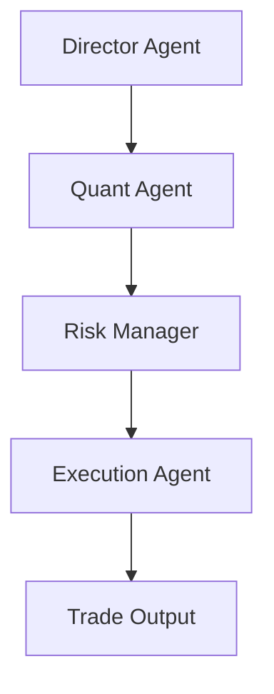

今天在 GitHub Trending 上看到一个有意思的项目：**AutoHedge**，一个号称"企业级自主智能体对冲基金"的开源项目，能基于 Swarm 多智能体协作，在 Solana 上自动完成市场分析、风险管理和下单执行。

## 一、项目概述

AutoHedge 由 The Swarm Corporation 维护，定位是"世界最强大的自主智能体对冲基金"。它把交易流程拆解为多个专职 Agent，以"群体智能（Swarm Intelligence）"的方式协作，尽可能减少人工干预。

核心特性：

- **多智能体架构**：每个交易环节由专门的 Agent 负责
- **实时市场分析**：接入实时行情数据进行分析与执行
- **风险优先设计**：任何下单前都先做风险管理和仓位控制
- **结构化输出**：分析结果以 JSON 格式输出，便于下游系统消费
- **企业级日志**：详细且可配置的日志，便于审计与调试
- **可扩展框架**：模块化设计，支持自定义策略和接入新交易场所

目前官方明确支持的交易场所是 Solana（全自主交易），Coinbase 与其他 CEX 在路线图中。

## 二、技术原理

AutoHedge 的核心是一条多 Agent 流水线，每个 Agent 职责单一、边界清晰：



### 1. 多智能体分工

| Agent | 职责 |
|-------|------|
| Director Agent（总监） | 生成交易策略与论点（thesis） |
| Quant Agent（量化） | 技术面与统计面分析 |
| Risk Management Agent（风控） | 仓位规模与风险评估 |
| Execution Agent（执行） | 订单生成与下单执行 |

这条流水线的设计哲学是"风险优先"：只有在风控 Agent 评估通过、确定了仓位规模之后，才会进入执行环节。这种"先评估、后执行"的顺序，相比直接由模型生成交易信号，更能约束模型的冲动输出。

### 2. 技术栈与选型

从 `pyproject.toml` 与 `requirements.txt` 可以看到其依赖：

```toml
python = "^3.10"
swarms = "*"
pydantic = "*"
loguru = "*"
swarm-models = "*"
httpx = "*"
solders = "*"
yfinance = "*"
python-dotenv = "*"
```

- **swarms / swarm-models**：底层智能体编排框架（Swarms 生态），提供多 Agent 协作能力
- **pydantic**：用结构化模型约束 Agent 的输出格式，保证"结构化输出"
- **solders**：Solana 生态的 Rust-Python 绑定库，用于钱包与链上交易构造
- **yfinance**：接入传统金融资产（如原油）的行情数据，支撑跨市场论点
- **loguru**：企业级日志
- **httpx**：异步 HTTP 请求，对接 Jupiter 等行情 API

### 3. 数据流

1. 用户给出高层任务（如"分析原油市场情绪并给出持仓论点"）
2. Director Agent 拆解任务、派生关注的标的（tickers）
3. Quant Agent 拉取行情（Jupiter / yfinance）做技术统计
4. Risk Manager 计算仓位与风险敞口，产出结构化 JSON
5. Execution Agent 生成订单并通过 Solana 钱包私钥签名执行

## 三、安装与快速开始

### 环境要求

- Python 3.10+
- 一个 Solana 钱包私钥（用于实盘执行）
- Jupiter API Key（用于行情与代币搜索）

### 安装

```bash
pip install -U autohedge
```

### 配置环境变量

```bash
# Jupiter API（代币价格与搜索工具），在 https://portal.jup.ag 申请
JUPITER_API_KEY=

# OpenAI / Anthropic（实验性 Agent）
OPENAI_API_KEY=
ANTHROPIC_API_KEY=

# Agent 工作目录
WORKSPACE_DIR="agent_workspace"

# 交易钱包私钥（⚠️ 高度敏感，切勿泄露）
WALLET_PRIVATE_KEY=""
```

完整配置可参考仓库的 `.env.example`。

### 最简运行

安装完成后，直接在命令行启动：

```bash
autohedge
```

## 四、使用方法与实战

`example.py` 给出了一个最小可运行示例，展示了如何用 Python API 形式调用：

```python
from autohedge import AutoHedge  # loads .env from project root

# 初始化交易系统（tickers 由总监 Agent 根据任务自动派生）
trading_system = AutoHedge(
    name="swarms-fund",
    description="Private Hedge Fund for Swarms Corp",
)

task = "Analyze the sentiment of oil market and provide a thesis on the overall market position and expected trends."
print(trading_system.run(task=task))
```

这里有几个值得注意的点：

- `AutoHedge` 在初始化时会从项目根目录自动加载 `.env`，因此环境变量无需手动传入
- `name` 与 `description` 用于标识这只"基金"的元数据
- `run(task=...)` 接收的是**自然语言任务**，而非具体标的列表——标的是由 Director Agent 自行派生的。这种"意图驱动"的接口降低了使用门槛，但也意味着你需要信任 Agent 的标的选取逻辑

进阶玩法上，由于框架基于 Swarms，你可以自定义每个 Agent 的提示词、模型与工具，接入自己的数据源或策略，甚至扩展到多个交易所、多种资产。

## 五、常见问题与解决方案

**1. 安装失败 / 依赖冲突**
`swarms`、`swarm-models` 等依赖更新较快，建议使用虚拟环境（venv / conda）隔离安装，并确认 Python 版本 ≥ 3.10。

**2. 缺少 API Key 导致运行报错**
若不配置 `JUPITER_API_KEY`，行情与代币搜索工具将无法工作。请到 [portal.jup.ag](https://portal.jup.ag) 申请免费 Key 并写入 `.env`。

**3. 私钥安全问题**
`WALLET_PRIVATE_KEY` 是链上资产的"终极钥匙"，务必：

- 只在本地 / 隔离环境使用
- 不要用含有真实大额资产的钱包做首次测试
- 切勿提交到 Git 或分享给他人

**4. 实盘执行与回测**
当前版本聚焦**实盘自主执行**，并未内置回测框架。在接入真实资金前，建议先在低风险钱包上小资金验证 Agent 的决策质量与执行链路。

**5. 兼容性与扩展**
目前完整支持 Solana，Coinbase 与其他 CEX 尚在开发中。若需新交易场所，可通过其模块化框架自行接入。

## 六、总结

AutoHedge 把一个完整的量化交易流程"智能体化"了：从策略生成、量化分析、风控到执行，全部由专职 Agent 协作完成，并以结构化 JSON 输出，工程化味道很浓。它适合想研究**多智能体 + 金融**落地、或对 Swarms 框架在交易场景应用感兴趣的人。

不过需要清醒认识：它默认是"实盘自主执行"的，风险控制依赖 Agent 自身的理性。在真正投入资金前，请务必在隔离的小额钱包上充分验证，并理解"AI 自主交易"在波动剧烈的加密市场中的风险。
