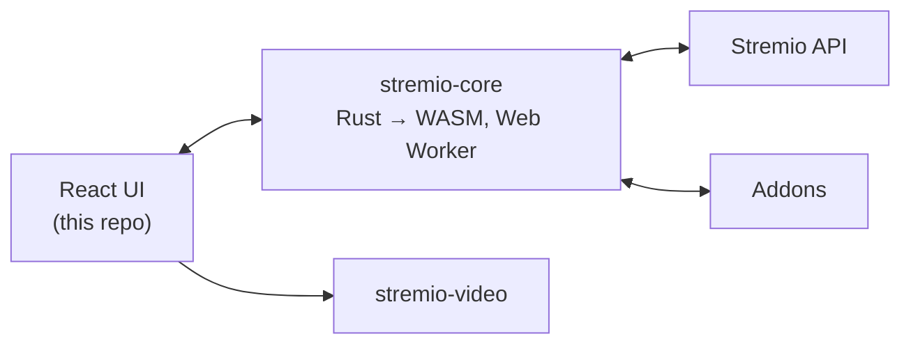

今天在 GitHub Trending 上看到一个很有意思的项目：**Stremio Web**，它是知名媒体中心 Stremio 的官方 Web UI——一个"UI 只负责渲染、核心逻辑交给 Rust"的现代架构范例，值得仔细拆解。

## 一、项目概述

Stremio 是一个"一站式视频娱乐中心"，而 **stremio-web** 正是它的官方 Web 端实现（线上版本可直接访问 web.stremio.com）。它解决的核心问题是：如何把一个跨设备的媒体中心完整搬进浏览器，同时保持桌面端一致的体验。

核心特性包括：

- **Addon 驱动的内容生态**：电影、剧集、直播频道等目录全部由 addon 提供，用户可自由安装/卸载内容源
- **全平台同步**：片库（Library）与"继续观看"（Continue Watching）跟随 Stremio 账号跨设备同步
- **Chromecast 投屏**：一键把播放从浏览器移交到大屏
- **字幕系统**：支持 addon 字幕与本地字幕，且可自定义样式
- **键盘优先的播放器**：全程无需鼠标即可控制播放
- **50+ 语言支持**：由社区通过 stremio-translations 仓库贡献翻译
- **PWA 可安装**：可作为独立应用运行

项目采用 GPL-2.0 协议，由 Smart Code OOD 维护，当前版本为 5.0.0-beta.39，属于一个相当活跃的成熟开源项目。

## 二、技术原理

### 2.1 架构设计：UI 与 Core 分离

这是该项目最值得学习的一点。README 中明确写道：

> The UI (this repo) is a React app, but the brains live in stremio-core — Stremio's Rust engine compiled to WebAssembly and running in a Web Worker. The UI renders state, the core computes it.

整个架构可概括为：**UI 渲染状态，Core 计算状态**。

- **stremio-core**：Stremio 的 Rust 引擎，负责状态管理、addon 协议、片库、同步等所有"大脑"逻辑，编译为 WASM 后运行在 Web Worker 中
- **React UI（本仓库）**：只负责把 Core 吐出的状态渲染成界面，并把用户交互事件回传给 Core
- **stremio-video**：视频播放抽象层，根据运行环境选择正确的播放器实现

数据流大致如下：



把"状态计算"放进 Rust/WASM 的好处很明显：核心逻辑与平台无关，桌面端、移动端、Web 端共享同一套引擎，行为完全一致；同时 Web Worker 隔离了计算线程，UI 渲染不会被核心逻辑阻塞。

### 2.2 前端工程化细节

从 `package.json` 与 `webpack.config.js` 可以看到几个工程细节：

**双入口构建**：除了主 UI 入口 `./src/index.js`，还单独打包了 Core 的 Worker 入口：

```javascript
entry: {
    main: './src/index.js',
    worker: './node_modules/@stremio/stremio-core-web/worker.js'
},
```

**产物按 commit hash 分目录缓存**：JS、CSS、WASM 产物都输出到 `${COMMIT_HASH}/` 目录下，配合 `http_server.js` 里超长的静态资源缓存时间（约 1 个月），实现"内容寻址式"的长期缓存：

```javascript
const ASSETS_CACHE = 2629744; // 秒，约 30.4 天
const HTTP_PORT = 8080;

express().use(express.static(build_path, {
    setHeaders: (res, path) => {
        if (path === index_path) res.set('cache-control', `public, max-age: ${INDEX_CACHE}`);
        else res.set('cache-control', `public, max-age: ${ASSETS_CACHE}`);
    }
}))
```

由于每个 commit 的静态资源路径都不同，缓存可以放心开到最大；只有 `index.html` 缓存较短（2 小时），保证新版本能及时被发现。

**WASM 处理**：`.wasm` 文件作为 asset 输出到 `${COMMIT_HASH}/binaries/`，由构建期确定的 hash 保证唯一性。

**多线程编译加速**：使用 `thread-loader` 开启 worker 池并行处理 babel/ts/css 转换，`workers: os.cpus().length` 直接吃满 CPU 核数：

```javascript
const THREAD_LOADER = {
    loader: 'thread-loader',
    options: {
        name: 'shared-pool',
        workers: os.cpus().length,
    },
};
```

**工程规范**：ESLint 采用 flat config（`eslint.config.mjs`），整合了 `typescript-eslint`、`eslint-plugin-react` 与 `@stylistic` 风格插件，统一 4 空格缩进、单引号、强制行尾换行等风格；并禁用了 `console.log`（仅允许 warn/error），保证线上日志干净。

### 2.3 PWA 与离线能力

生产构建通过 `workbox-webpack-plugin` 的 `GenerateSW` 生成 Service Worker，并设置 `clientsClaim: true` 与 `skipWaiting: true`——新版本一旦构建完成便立即接管页面，避免用户停留在旧版本上。

## 三、安装与快速开始

### 3.1 环境要求

- **Node.js 22+**
- **pnpm 11+**（项目使用 pnpm workspace + 严格锁文件）

### 3.2 本地开发

```bash
pnpm install
pnpm start
```

开发服务器运行在 `http://localhost:8080`（HTTPS 模式，因为 Service Worker 与部分浏览器 API 需要安全上下文）。

常用命令：

| 命令 | 说明 |
|---|---|
| `pnpm start` | 开发服务器（热更新） |
| `pnpm run start-prod` | 以生产模式运行开发服务器 |
| `pnpm run build` | 生产构建 |
| `pnpm test` | 运行测试（Jest） |
| `pnpm run lint` | ESLint 检查源码 |
| `pnpm run scan-translations` | 检查缺失的翻译 key |

### 3.3 Docker 部署

项目提供了多阶段构建的 Dockerfile：

```bash
docker build -t stremio-web .
docker run -p 8080:8080 stremio-web
```

Dockerfile 值得注意的点：使用 `corepack enable` 激活 pnpm，先只拷贝 `package.json` + 锁文件安装依赖（充分利用层缓存），构建完成后在最终镜像里只保留 `build/` 产物和一个极简的 express 静态服务器（`http_server.js`），镜像非常精简。

## 四、使用方法与实战

### 4.1 基础用法

打开线上版（web.stremio.com）或用 Docker 自托管后，核心使用路径是：

1. 进入 **Addons** 页安装内容源（社区有大量现成 addon，如各大公开目录、字幕源等）
2. 在 Discover 页浏览各 addon 提供的电影/剧集目录
3. 播放时选择视频源与字幕，可切换倍速、使用键盘控制
4. 登录 Stremio 账号后，片库与观看进度自动同步

### 4.2 进阶：用 stremio-addon-sdk 开发自己的 Addon

Stremio 生态的开放性在于，任何人都可以开发 addon。官方提供 Node.js 版 SDK（stremio-addon-sdk），一个最小 addon 只需定义 `manifest` 与资源处理函数即可发布，随后在 Stremio 的 Addons 页通过 URL 安装。这也是"内容与播放器解耦"思想的落地：Stremio 本身不生产内容，只提供框架。

### 4.3 二次开发建议

如果想基于 stremio-web 做定制（例如改 UI 主题、接入私有 addon 源），推荐路径：

1. `fork` 仓库，本地 `pnpm install && pnpm start`
2. 修改 `src/` 下的 React 组件（注意仓库有 `stremio/*` 路径别名映射到 `src/*`）
3. 需要改核心行为时，关注上游 `stremio-core` 的更新，依赖版本集中在 `package.json`

## 五、常见问题与解决方案

**Q1：pnpm install 安装失败？**
项目依赖部分包直接引用 GitHub 源（如 `langs`、`spatial-navigation-polyfill`、`stremio-translations`），网络不稳时容易失败。可配置镜像/代理，或重试；确保 pnpm 版本 ≥ 11，Node ≥ 22，否则 engines 校验会报错。

**Q2：开发服务器起不来 / 端口被占用？**
dev server 固定监听 `8080` 且强制 HTTPS（自签名证书）。若端口被占用请先释放 8080；浏览器访问自签名 HTTPS 地址时需手动信任证书。

**Q3：`pnpm run lint` 报错？**
项目 lint 规则较严格（禁 console.log、强制单引号/4 空格缩进等）。提交前可用 `pnpm run lint` 自检，或按报错提示用 `--fix` 类方式自动修复。

**Q4：Docker 构建很慢？**
多阶段构建中依赖层已做缓存优化，但首次构建仍需拉取 base 镜像（node:22-alpine）并安装全部依赖。建议保持 `pnpm-lock.yaml` 不变以命中层缓存；网络环境差时可换用国内镜像加速。

**Q5：想部署到自己的服务器，如何更新到最新版？**
镜像只包含构建产物与静态服务器，更新只需重新 `docker build` 并重启容器。由于静态资源按 commit hash 分目录且 index.html 缓存仅 2 小时，客户端会在较短时间内自动切换到新版本。

**Q6：播放器黑屏 / 无法解码？**
播放由 stremio-video 根据环境选择实现，可能与浏览器或视频编码有关。先确认浏览器版本较新（WASM 与 MSE 支持），再尝试更换视频源或关闭硬件加速。

## 六、总结

Stremio Web 的价值不只是"又一个视频网站前端"，而是一个值得借鉴的现代架构样本：

- **Rust 核心 + WASM + Web Worker**：把平台无关的复杂状态逻辑下沉到共享引擎，UI 层保持轻薄
- **Addon 生态**：内容与框架彻底解耦，第三方可无限扩展
- **前端工程细节扎实**：commit-hash 内容寻址缓存、多线程编译、严格 lint、多阶段 Docker 构建

如果你对"如何用 WebAssembly 承载核心业务逻辑"或"如何设计可插拔内容生态"感兴趣，stremio-web 连同它的 stremio-core / stremio-video / stremio-addon-sdk 系列仓库，是一套非常完整的开源参考实现。

仓库地址：<https://github.com/Stremio/stremio-web>
