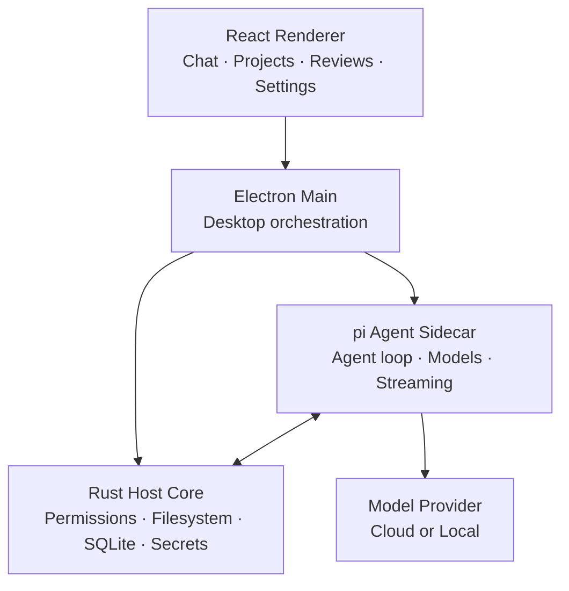

今天在 GitHub Trending 上看到一个颇有意思的项目：**PI-Desktop**——一个「本地优先（local-first）」的桌面应用，目标是给 AI 编程代理一个真正属于自己的工作台。它不绑定任何编辑器、不强依赖云服务，而是让你自带模型、打开任意本地项目，把读文件、改代码、跑命令这些高权限动作都收束到一层权限审批之下。

## 一、项目概述

PI-Desktop 是 `vastsa` 开源的桌面客户端（当前处于 Early Preview，版本线 `0.14.x`），用 Electron + React + Rust + TypeScript 构建，专门服务于 AI 编程代理（coding agent）。它的核心主张可以概括成三句话：

- **桌面优先**：项目和会话不再被绑死在某个编辑器或终端里。项目、对话、代码审查、文件、预览、通知、扩展全部收进一个工作区。
- **自带模型**：OpenAI、Anthropic、本地模型（Ollama / LM Studio）、各类 OpenAI 兼容网关都能接，一个会话里还能随时切换 provider 和模型。
- **本地优先**：没有强制账号、没有强制中继，对话、设置、凭据都留在你自己的机器上，且明确声明「零遥测」。

它要解决的本质问题是：现在大多数 coding agent 要么活在终端里、要么活在编辑器插件里、要么活在托管服务里。PI-Desktop 想给 agent 一个独立、可审查、可长驻的桌面环境。

## 二、技术原理

### 架构分层

PI-Desktop 刻意把「UI」与「特权主机能力」「agent 循环」三者拆开。仓库里的架构图很直观地表达了这一点：



几个关键设计点：

- **渲染层无 Node 集成**（renderer has no Node integration），特权操作一律下沉。
- **Rust Host Core** 拥有工作区的特权操作：权限、文件系统、SQLite 持久化、密钥（secret）。
- **pi Agent Sidecar** 负责模型交互和 agent 循环。它基于 `pi-mono` 的 `pi-ai` 与 `pi-agent-core` 构建。
- Electron 只负责桌面生命周期编排，把职责清晰地隔离在不同进程里。

### 权限层：可审查而非全权委托

这是 PI-Desktop 区别于「把终端直接交给 agent」的核心。Agent 可以读文件、改代码、跑命令，但**特权动作都要经过权限层**：你能看到 diff、检查命令输出，并为每个会话决定要给多少自主度。

### Agent / Plan / Goal 三种门控

同一个 agent，三道不同的闸口：

| 模式 | 你需要审批 | agent 做什么 |
| --- | --- | --- |
| **Agent** | 无额外审批 | 读树、改文件、跑命令、测试、迭代 |
| **Plan** | 一份冻结的实现计划 | 先研究仓库、写出不可变计划，再等你签字才开始执行 |
| **Goal** | 目标与验收标准 | 由 agent 自己选路径，直到目标达成 |

- **Agent** 是默认循环：检视目录树、打补丁、执行命令、持续推进。
- **Plan** 是「审批边界」：先研究再产出一份 immutable 计划，你 sign-off 后才执行。
- **Goal** 是「结果优先」：你锁定目标和验收标准，路径由 agent 决定。

三种模式下，特权工具都仍然受权限层约束。

### Subagents 与长会话

大任务不适合塞进一个上下文窗口。PI-Desktop 可以把独立工作委派给后台 Subagent，用于代码库探索、多文件实现、调研、测试分析、对抗性审查等。每个 Subagent 跑在自己的上下文里，把结果回报给父 agent。

工作区本身也为长会话设计：多项目管理、会话置顶/归档、会话分支、agent 运行时排队的 prompt、`@` 引用文件、斜杠命令、跨应用搜索；流式响应会被 checkpoint，应用崩溃或重启时尽量能恢复未完成的工作。

### 本地优先的数据边界

「本地优先」不是「永远不碰网络」，而是把该留在本地的留好：

| 数据 | 行为 |
| --- | --- |
| 对话 | 本地 JSONL 存储 + SQLite 索引 |
| 设置 | 存于本机 |
| API 凭据 | 存于操作系统钥匙串（keychain） |
| 日志 | 本地 |
| 遥测 | 无 |
| 模型请求 | 直接发往你配置的 provider / endpoint |

没有强制账号，也没有夹在你机器和模型 provider 之间的 PI 中继。

## 三、安装与快速开始

### 直接下载安装包

从 [GitHub Releases](https://github.com/vastsa/PI-Desktop/releases/latest) 取最新构建：

| 平台 | 架构 | 包 |
| --- | --- | --- |
| macOS | Apple Silicon | `.dmg` / `.zip` |
| macOS | Intel | `.dmg` / `.zip` |
| Windows | x64 | NSIS 安装器 / 便携 exe |
| Linux | x64 | `.AppImage` / `.deb` / `.rpm` / `.asar` |

- Linux x64 需要 **glibc 2.35+**（Ubuntu 22.04 / Debian 12 / Fedora 36 及以上）；老系统无法加载内置 host，可用 `ldd --version` 自查。
- macOS 的发布产物会用 Developer ID 签名、公证并 staple。

### 从源码本地运行

仓库当前版本在 `Cargo.toml` 里声明为 `0.14.6-rc.3`，要求：

- Node.js `>=22.19`
- pnpm `>=10`（仓库实际 pin 了 pnpm 11）
- 稳定的 Rust 工具链

```bash
git clone https://github.com/vastsa/PI-Desktop.git
cd PI-Desktop

pnpm install

cargo build -p host-core
pnpm build:js

pnpm dev
```

校验改动时有一整套脚本可用：

```bash
pnpm typecheck
pnpm lint
pnpm test
```

其中 `build:host` 对应 `cargo build --release -p host-core`，`test:host` 对应 `cargo test -p host-core`——Rust Host Core 既是特权能力的载体，也是构建与测试的关键一环。

## 四、使用方法与实战

### 从一句话到一次 PR

工作流被压缩成四步：

1. **连接模型**：打开 `Settings → Model configuration`，选 provider 或兼容 API，填入凭据。
2. **打开项目**：从侧边栏添加任意本地仓库或项目目录。
3. **选 Agent / Plan / Goal**：Agent 直接开干；Plan 等你批准冻结计划；Goal 等你批准结果再让 agent 自选路径。
4. **审查结果**：在 Review 面板里看 diff、查命令输出、预览应用，全程不离开 PI-Desktop。

模型配置还能带上上下文窗口、输出上限、推理开关、temperature 等模型级行为，并且可以在 Composer 里直接切模型而无需重建会话。

### 实战示例：用 Plan 模式改一段代码

假设你想给项目加一个限流工具。与其让 agent 直接动手，可以走 **Plan**：

- 你在对话框里描述需求，agent 进入研究阶段，遍历目录树、读相关文件，产出一份不可变的实现计划（涉及哪些文件、改什么、加什么测试）。
- 你在 Review 面板里逐条确认，签字后 agent 才开始执行。
- 执行期间它的 `edit` / `run command` 等特权动作依然过权限层，你可以随时介入。

### 扩展：Skills / MCP / Subagents / Plugins

PI-Desktop 提供多层扩展，避免为了加个能力就重编译应用：

- **Skills**：给 agent 可复用的指令与工作流，可全局安装或仅对某个项目激活。
- **MCP**：通过 Model Context Protocol 连外部工具/服务，不必 bake 进桌面应用。
- **Subagents**：创建带自己指令、工具、模型选择的专用 agent，再委派任务。
- **Plugins**：通过 `.piplug` 包流程，本地或市场安装，可贡献 agent 工具、命令、面板、视图、Skills、MCP、Subagents、主题、常驻服务等。

> 注意：插件进程受权限门控且与渲染层隔离，但仍是「用户信任的代码」，不是完整 OS 沙箱。只装你信任的插件。

另外，如果你已经在用别的 coding agent，PI-Desktop 能从 Claude Code、Codex、OpenCode、Pi 导入本地会话（`Settings → Import`）。

## 五、常见问题与解决方案

**Q1：Linux 启动报错、host 加载失败？**
A：多半是 glibc 太旧。Linux x64 需要 glibc 2.35+，用 `ldd --version` 确认；Ubuntu 20.04 / Debian 11 / Fedora 35 及更早版本无法加载内置 host。

**Q2：模型总连不上 / 想换本地模型？**
A：PI-Desktop 不锁定模型列表。在 `Model configuration` 里加 OpenAI / Anthropic / Ollama / LM Studio / 任意 OpenAI 兼容 endpoint，同一个 provider 下可配多个模型并随时切换；凭据只存在系统钥匙串里。

**Q3：担心 agent 乱改文件或乱跑命令？**
A：用权限层 + Plan/Goal 模式。Plan 先出冻结计划，Goal 先锁验收标准；所有特权工具都过权限层，你能在 Review 面板看到 diff 与命令输出再放行。

**Q4：会话太长、上下文不够用？**
A：把独立子任务委派给后台 Subagent，每个跑在独立上下文；也可以用会话分支、队列 prompt、长会话 checkpoint 来抗中断。

**Q5：插件安全吗？**
A：插件进程被权限门控且与渲染层隔离，但属于用户信任代码而非 OS 级沙箱，只安装可信来源的插件。

## 六、总结

PI-Desktop 的价值不在于「又一个 chat 窗口」，而在于它把 coding agent 当成一类需要**独立桌面环境 + 明确权限边界 + 可扩展生态**的工作负载来对待：本地优先保证数据可控，自带模型保证不被供应商锁死，Plan/Goal 三种门控让自主度可控，Rust Host Core + 权限层让高权限动作可审查，插件体系又留足了生长空间。

它当前还是 Early Preview（0.14.x），API、扩展接口和部分桌面行为仍在演进，但对「想要一个不绑定编辑器、不依赖云、又能放心让 agent 动手的本地工作台」的开发者来说，已经是值得跟进的方向。项目基于 LGPL-3.0 开源，想尝鲜可直接从 [Releases](https://github.com/vastsa/PI-Desktop/releases/latest) 下载。

> 项目地址：[github.com/vastsa/PI-Desktop](https://github.com/vastsa/PI-Desktop)
